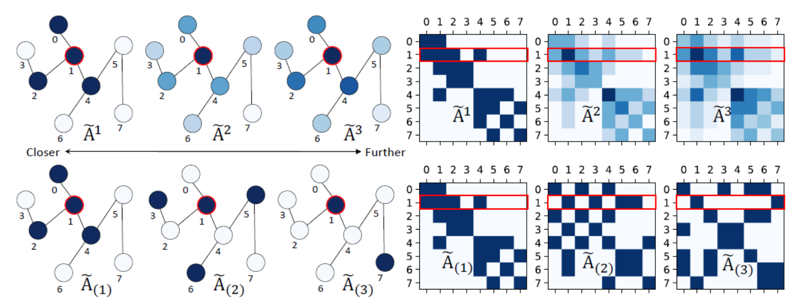
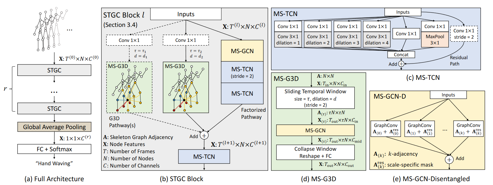

# Disentangling and Unifying Graph Convolutions for Skeleton-Based Action Recognition

# `基于骨架的动作识别的图卷积解耦和统一`

[TOC]

## Abstract

   Spatial-temporal graphs have been widely used by skeleton-based action recognition algorithms to model human action dynamics. `时空图被广泛应用于基于骨架的动作识别算法来对人类动作动态进行建模。` To capture robust movement patterns from these graphs, long-range and multi-scale context aggregation and spatial-temporal dependency modeling are critical aspects of a powerful feature extractor. `为了从这些图片中获取稳健的运动模式，长期和多尺度的上下文聚合和时空依赖建模是一个强大的特征提取器的重要方面。` However, existing methods have limitations in achieving (1) unbiased long-range joint relationship modeling under multi-scale operators and (2) unobstructed cross-spacetime information flow for capturing complex spatial-temporal dependencies. `但是，现有方法在实现 (1) 在多尺度算子下的无偏差长期关节关系建模和 (2) 为捕捉复杂时空依赖的流畅的跨时空信息流等方面存在局限。` In this work, we present (1) a simple method to disentangle multi-scale graph convolutions and (2) a unified spatial-temporal graph convolutional operator named G3D. `在这项工作中，我们提出了 (1) 一个用于分解多尺度图卷积的简单方法和 (2) 一种统一的时空图卷积算子，G3D。` The proposed multi-scale aggregation scheme disentangles the importance of nodes in different neighborhoods for effective long-range modeling. `所提到的多尺度聚合方法解决了在不同邻域中节点对于长期建模的重要性。` The proposed G3D module leverages dense cross-spacetime edges as skip connections for direct information propagation across the spatial-temporal graph. `所提到的G3D模型利用稠密的跨时空边界作为跳跃连接，用于时空图之间直接的信息传播。` By coupling these proposals, we develop a powerful feature extractor named MS-G3D based on which our model outperforms previous state-of-the-art methods on three large-scale datasets: NTU RGB+D 60, NTU RGB+D 120, and Kinetics Skeleton 400. `综上所述，我们开发了一个强大的特征提取器MS-G3D。基于它，我们在3个大规模数据集NTU RGB+D 60、NTU RGB+D 120和Kinetics Skeleton 400上的性能优于之前最先进的方法。` 

## 1. Introduction

>
>
>
>
>Figure 1: (a) Factorized spatial and temporal modeling on skeleton graph sequences causes indirect information flow. `(a) 分离的骨架图序列时间和空间建模导致间接的信息流。` (b) In this work, we propose to capture cross-spacetime correlations with unified spatial-temporal graph convolutions. `(b) 在这项工作中，我们提出使用统一的时空图卷积来捕获跨时空的相关性。` (c) Disentangling node features at separate spatial-temporal neighborhoods (yellow, blue, red at different distances, partially colored for clarity) is pivotal for effective multi-scale learning in the spatial-temporal domain. `(c) 在不同的时空邻域中分离节点特征（不同距离的黄、蓝、红，部分上色用于区分）对于时空域中的有效的多尺度学习而言十分关键。` 

​    Human action recognition is an important task with many real-world applications. `人类动作识别是许多现实应用中的一项重要任务。` In particular, skeleton-based human action recognition involves predicting actions from skeleton representations of human bodies instead of raw RGB videos, and the significant results seen in recent work [^50][^33][^32][^34][^21][^20 ][^54][^35] have proven its merits. `特别地，基于骨架的人类动作识别涉及从人类身体的骨架表征预测动作，而非原始的RGB视频，并且最近的工作中发现的一些有意义的结果证明了它的优势。` In contrast to RGB representations, skeleton data contain only the 2D [^50][^15] or 3D [^31][^25] positions of the human key joints, providing highly abstract information that is also free of environmental noises ($e.g.$ background clutter, lighting conditions, clothing), allowing action recognition algorithms to focus on the robust features of the action. `对比RGB表征，骨架数据只包含人体关键关节2D或3D位置，提供了高度抽象的信息并且没有环境噪声（如背景杂波、光照条件、衣服），使得动作识别算法可以专注于动作的稳健特征。` 

​    Earlier approaches to skeleton-based action recognition treat human joints as a set of independent features, and they model the spatial and temporal joint correlations through hand-crafted [^42][^43] or learned [^31][^6][^48][^54] aggregations of these features. `早期的基于骨架的动作识别方法将人体关节看作一组独立的特征，他们通过手动制造的或者学习的特征的集合来建模时间和空间上关节的相关性。` However, these methods overlook the inherent relationships between the human joints, which are best captured with human skeleton graphs with joints as nodes and their natural connectivity (i.e. “bones”) as edges. `然而，这些方法忽视了人体关节之间的内在关系，这种关系最好利用人体骨架图来捕捉，人体骨架图中的关节为节点，它们的自然连接（即“骨头”）为边。` For this reason, recent approaches [^50][^34][^35][^32] model the joint movement patterns of an action with a skeleton spatial-temporal graph, which is a series of disjoint and isomorphic skeleton graphs at different time steps carrying information in both spatial and temporal dimensions. `因此，最近的研究方法利用骨架时空图建立了动作的关节运动模式的模型，骨架时空图是一系列不相交、同构的不同时间步长的骨架图，携带空间和时间维度上的信息。` 

​    For robust action recognition from skeleton graphs, an ideal algorithm should look beyond the local joint connectivity and extract multi-scale structural features and long-range dependencies, since joints that are structurally apart can also have strong correlations. `为了从骨架图中获取稳健的动作识别，理想的算法应该超脱局部关节连接性，提取多尺度结构特征和长期依赖关系，因为结构上分离的关节也可以有很强的相关性。` Many existing approaches achieve this by performing graph convolutions [^17] with higher-order polynomials of the skeleton adjacency matrix:`许多现有的方法通过使用骨架邻接矩阵的高次幂来实现这一目的：`intuitively, a powered adjacency matrix captures the number of walks between every pair of nodes with the length of the walks being the same as the power;`直观地，邻接矩阵的幂来捕获每对节点之间的路径数，且行走的长度与幂相同；`the adjacency polynomial thus increases the receptive field of graph convolutions by making distant neighbors reachable. `邻接多项式通过使远邻可达来增加图卷积的感受野。` However, this formulation suffers from the biased weighting problem, where the existence of cyclic walks on undirected graphs means that edge weights will be biased towards closer nodes against further nodes. `然而，这种方法存在权重偏差的问题，无向图上环的存在意味着边的权重偏向于更靠近的节点而不是更远的节点。` On skeleton graphs, this means that a higher polynomial order is only marginally effective at capturing information from distant joints, since the aggregated features will be dominated by the joints from local body parts. This is a critical drawback limiting the scalability of existing multi-scale aggregators. `在骨架图上，这意味着邻接矩阵高次幂只能低效地捕捉远处关节的信息，因为聚集的特征将由局部身体部位的关节主导。 这是限制现有多尺度聚合器可伸缩性的一个严重缺陷。` 

Another desirable characteristic of robust algorithms is the ability to leverage the complex cross-spacetime joint relationships for action recognition. `稳健算法的另一个理想特征是利用复杂跨时空关节关系进行动作识别的能力。` However, to this end, most existing approaches [^50][^33][^19][^32][^21][^34][^18] deploy interleaving spatial-only and temporal-only modules (Fig. 1(a)), analogous to factorized 3D convolutions [^30][^39]. `然而，到目前为止，大多数现有的发放部署的仅空间和仅时间交错的模块（图1 (a) ）,类似于分解的3D卷积。` A typical approach is to first use graph convolutions to extract spatial relationships at each time step, and then use recurrent [^19][^34][^18] or 1D convolutional [^50][^33][^21][^32] layers to model temporal dynamics. `一个典型的方法是首先使用图卷积提取每个步长的空间关系，然后使用循环神经网络或者一维卷积层建立时间动态模型。` While such factorization allows efficient long-range modeling, it hinders the direct information flow across spacetime for capturing complex regional spatial-temporal joint dependencies. `虽然这样的分解方法可以进行有效的长期建模，但是它阻碍了跨时空的直接信息流，无法捕获复杂的区域时空关节依赖。` For example, the action “standing up” often has co-occurring movements of upper and lower body across both space and time, where upper body movements (leaning forward) strongly correlate to the lower body’s future movements (standing up). `例如，“站立”动作通常是上身在空间和时间上的共同运动，上身的运动（向前倾）与下身未来的运动（站立）有很强的相关性。` These strong cues for making predictions may be ineffectively captured by factorized modeling. `这些用于预测的有力的线索可能无法有效地被分解的建模方法所捕获。` 

​    In this work, we address the above limitations from two aspects. `在这项工作中，我们通过两方面解决了上述局限。` First, we propose a new multi-scale aggregation scheme that tackles the biased weighting problem by removing redundant dependencies between further and closer neighborhoods, thus disentangling their features under multi-scale aggregation (illustrated in Fig. 2). `首先，我们提出了一种新的多尺度聚合方案，通过消除较远和较近邻域之间的冗余依赖关系来解决权重偏差问题，从而理顺多尺度聚合下的特征（如图2所示）。` This leads to more powerful multi-scale operators that can model relationships of joints irrespective of the distances between them. `这使我们得到了一个强大的多尺度算子，它可以对关节之间的关系进行建模，而不用考虑它们之间的距离。` Second, we propose G3D, a novel unified spatial-temporal graph convolution module that directly models cross-spacetime joint dependencies. `其次，我们提出了G3D，一个全新的统一的时空图卷积模块，它可以直接对跨时空关节的依赖关系进行建模。` G3D does so by introducing graph edges across the “3D” spatial-temporal domain as skip connections for unobstructed information flow (Fig. 1(b)), substantially facilitating spatial-temporal feature learning. `G3D通过引入跨越“3D”时空域的图形边作为无障碍信息流的跳过连接来做到这一点（图1(b)），实质上促进了时空特征学习。` Remarkably, our proposed disentangled aggregation scheme augments G3D with multi-scale reasoning in spacetime (Fig. 1(c)) without being affected by the biased weighting problem, despite extra edges were introduced. `值得注意的是，我们提出的解耦聚合方案强化了 G3D  的多尺度时空推理（图1(c)），尽管引入了额外的边，但是没有受到偏差权重问题的影响。` The resulting powerful feature extractor, named MS-G3D, forms a building block of our final model architecture that outperforms state-of-the-art methods on three large-scale skeleton action datasets: NTU RGB+D 120 [^25], NTU RGB+D 60 [^31], and Kinetics Skeleton 400 [^15]. `由此产生的强大的特征提取器，G3D，构成了我们在3个大规模骨架数据集：NTU RGB+D、NTU RGB+D 60和Kinetics Skeleton 400上优于最先进的方法的最终框架的基石，`The main contributions of this work are summarized as follows:`这项工作的主要贡献概括如下：`

(i) We propose a disentangled multi-scale aggregation scheme that removes redundant dependencies between node features from different neighborhoods, which allows powerful multi-scale aggregators to effectively capture graph wide joint relationships on human skeletons. `我们提出了一种解耦多尺度聚合的方法，它消除了不同邻域节点特征之间的冗余依赖关系，使得强大的多尺度聚合器能够有效地从人体骨架上捕获图形广义关节关系。` 

(ii) We propose a unified spatial-temporal graph convolution (G3D) operator which facilitates direct information flow across spacetime for effective feature learning. `我们提出了一种统一的时间-空间图卷积（G3D）算子，它促使信息跨时空直接流动，实现了高效的特征学习。` 

(iii) Integrating the disentangled aggregation scheme with G3D gives a powerful feature extractor (MS-G3D) with multi-scale receptive fields across both spatial and temporal dimensions. `将解耦聚合方案与 G3D 相结合，提供了一个强大的特征提取器(MS-G3D) ，具有跨时空的多尺度感受野。 `The direct multi-scale aggregation of features in spacetime further boosts model performance. `时空特征的直接多尺度聚合进一步提高了模型性能。` 

## 2. Related Work

### 2.1. Neural Nets on Graphs

**Architectures**. `架构`To extract features from arbitrarily structured graphs, Graph Neural Networks (GNNs) have been developed and explored extensively [^5][^17][^3][^2][^10][^40][^49][^1][^7][^11][^22]. `为了从任意结构的图中提取特征，图神经网络(GNNs)得到了广泛的发展和探索。` Recently proposed GNNs can broadly be classified into spectral GNNs [^3][^11][^22][^13][^17] and spatial GNNs [^17][^49][^10][^51][^41][^1][^45]. `最近提出的GNN方案大致可分为频谱GNN和空域GNN。` Spectral GNNs convolve the input graph signals with a set of learned filters in the graph Fourier domain. `频谱GNN将输入的图形信号与图傅立叶域中的一组学习滤波器进行卷积。` They are however limited in terms of computational efficiency and generalizability to new graphs due to the requirement of eigendecomposition and the assumption of fixed adjacency. `但是，因为特征分解的要求和固定邻接的假设，它们受限于计算效率和新图的推广性`Spatial GNNs, in contrast, generally perform layer-wise update for each node by (1) selecting neighbors with a neighborhood function ($e.g.$ adjacent nodes); (2) merging the features from the selected neighbors and itself with an aggregation function ($e.g.$ mean pooling); and (3) applying an activated transformation to the merged features ($e.g.$ MLP [^49]). `与之相反，空域GNN通常通过（1）选择具有邻域函数的邻居（例如，相邻节点）；（2）使用聚集函数将来自所选择的邻居及其自身的特征合并（例如，均值池）；以及（3）将激活的变换应用于合并的特征（例如，MLP），来执行针对每个节点的层级更新。` Among different GNN variants, the Graph Convolutional Network (GCN) [^17] was first introduced as a first-order approximation for localized spectral convolutions, but its simplicity as a mean neighborhood aggregator [^49][^46] has quickly led many subsequent spatial GNN architectures [^49][^1][^45][^7] and various applications involving graph structured data [^44][^47][^52][^50][^33][^34][^21] to treat it as a spatial GNN baseline. `在不同的GNN变体中，图卷积网络(GCN)最初是作为局部频谱卷积的一阶近似引入的，但它作为平均邻域聚合器的简单性迅速导致许多后续的空域GNN体系结构和涉及图结构数据的各种应用将其视为空域GNN基线。` This work adapts the layer-wise update rule in GCN. `本文采用了GCN中的分层更新规则。` 

**Multi-Scale Graph Convolutions.** `多尺度图卷积`Multi-scale spatial GNNs have also been proposed to capture features from non-local neighbors. `多尺度空域GNNs也被提出用于捕捉非局部邻域的特征。` [^1][^19][^21][^45][^24] use higher order polynomials of the graph adjacency matrix to aggregate features from long-range neighbor nodes. `这些工作使用图邻接矩阵的邻接矩阵高次幂来聚合来自远处邻居节点的特征`Truncated Block Krylov network [^29] similarly raises the adjacency matrix to higher powers and obtains multi-scale information through dense features concatenation from different hidden layers. `Truncated Block Krylov network同样将邻接矩阵提高到更高的幂次，并通过不同隐层的密集特征串联来获得多尺度信息。` LanczosNet [^24] deploys a low-rank approximation of the adjacency matrix to speed up the exponentiation on large graphs. `LanczosNet利用邻接矩阵的低秩近似来加速大型图的幂运算。` As mentioned in Section 1, we argue that adjacency powering can have adverse effects on long-range modeling due to weighting bias, and our proposed module aims to address this with disentangled multi-scale aggregators. `如第1节所述，我们认为邻接权重可能会因权重偏差而对长期建模产生不利影响，而我们提出的模块旨在通过解耦的多尺度聚合器解决这一问题。` 

### 2.2. Skeleton-Based Action Recognition 

​    Earlier approaches [^42][^6][^31][^36][^43][^48][^54] to skeleton-based action recognition focus on hand-crafting features and joint relationships for downstream classifiers, which ignore the important semantic connectivity of the human body. `早期的基于骨架的动作识别方法侧重于下游分类器的手工制作特征和关节关系，忽略了人体重要的语义连接。` By constructing spatial-temporal graphs and modeling the spatial relationships with GNNs directly, recent approaches [^50][^19][^8][^21][^8][^33][^32][^34][^18] have seen significant performance boost, indicating the necessity of the semantic human skeleton for action predictions. `通过构造时空图和直接用GNNs建模空间关系，最近的方法的性能得到了显著提高，这表明人体骨架的语义对于动作预测的必要性。` 

​    An early application of graph convolutions is ST-GCN [^50], where spatial graph convolutions along with interleaving temporal convolutions are used for spatial-temporal modeling.`图卷积的一个早期应用是ST-GCN，其中空间图卷积与交错时间卷积一起用于时空建模。`  A concurrent work by Li et al. [^19] presents a similar approach, but it notably introduces a multi-scale module by raising skeleton adjacency to higher powers. `李等共同作者提出了一个类似的方法，通过提高骨架邻接矩阵到更高的幂次来引入多尺度模块。` AS-GCN [^21] also uses adjacency powering for multi-scale modeling, but it additionally generates human poses to augment the spatial graph convolution. `AS-GCN也使用邻接矩阵的幂进行多尺度建模，但它还额外生成人体姿势以增强空间图卷积。` Spatial-Temporal Graph Routing (STGR) network [^18] adds extra edges to the skeleton graph using frame-wise attention and global self-attention mechanisms. `时空图路由（STGR）网络使用逐帧注意和全局自注意机制为骨架图添加额外的边。` Similarly, 2s-AGCN [^33] introduces graph adaptiveness with self-attention along with a freely learned graph residual mask. `类似地，2s-AGCN引入了具有自注意的图形自适应性以及自由学习的图形残差掩码。` It also uses a two-stream ensemble with skeleton bone features to boost performance. `它还使用具有骨架骨骼特征的双流集成来提高性能。` DGNN [^32] likewise leverages bone features, but it instead simultaneously updates the joint and bone features through an alternating spatial aggregation scheme. `DGNN同样利用了骨骼特征，但是它通过交替的空间聚合方案同时更新关节和骨骼特征。` Note that these approaches primarily focus on spatial modeling; in contrast, we present a unified approach for capturing complex joint correlations directly across spacetime. `要提出来的是，上述这些方法主要集中在空间建模上；相比之下，我们提出了一种统一的方法，用于直接跨时空捕获复杂的关节相关性。` 

​    Another relevant work is GR-GCN [^8], which merges every three frames over the skeleton graph sequence and adds sparsified edges between adjacent frames. `另一个相关的工作是GR-GCN，它在骨架图序列上每三帧合并一次，并在相邻帧之间添加稀疏边。` Whereas GR-GCN also deploys cross-spacetime edges, our G3D module has several important distinctions: `虽然GR-GCN也应用了跨时空边，但跟我们的G3D模块有几个重要区别：`(1) Cross-spacetime edges in G3D follow the semantic human skeleton, which is naturally a more interpretable and more robust representation than the sparsified, one-size-fits-all graph in GR-GCN. The underlying graph is also much easier to compute. `（1）G3D中的跨时空边遵循语义人体骨架，与GR-GCN中稀疏的、一刀切的图相比，G3D中的跨时空边自然是一种更可解释、更健壮的表示。底层图形也更容易计算。` (2) GR-GCN has cross-spacetime edges only between adjacent frames, which prevents it to reason beyond a limited temporal context of three frames. `（2）GR-GCN仅在相邻帧之间具有跨时空边，这使其无法推理超出三个帧的有限时间范围。` (3) G3D can learn from multiple temporal contexts simultaneously leveraging different window sizes and dilations, which is not addressed in GR-GCN. `（3）G3D可以同时利用不同的窗口大小和膨胀从多个时间上下文中学习，这在GR-GCN中没有解决。` 

## 3. MS-G3D
> 
>
> 
>
> Figure 2: Illustration of the biased weighting problem and the proposed disentangled aggregation scheme. `图二：偏差问题和所提出得解耦聚合方案的图解。` Darker color indicates higher weighting to the central node (red). `颜色越深表示对于中心节点的权重越大（红色）。` Top left: closer nodes receive higher weighting from adjacency powering, which makes long-range modeling less effective, especially when multiple scales are aggregated. `左上角：越近的节点从邻接矩阵获得更高的权重，这会降低长期建模的效率，特别是在聚合多个尺度时。` Bottom left: our proposed disentangled aggregation models joint relationships at each neighborhood while keeping identity features. `左下：我们提出的解缠结聚合模型在保持自身特征的同时，对每个邻域的关节关系进行建模。` Right: Visualizing the corresponding adjacency matrices. Node self-loops are omitted for visual clarity. `右：可视化相应的邻接矩阵。 为了视觉清晰，省略了节点自环。`
### 3.1. Preliminaries 
**Notations.** A human skeleton graph is denoted as ${\mathcal G} = ({\mathcal V}, {\mathcal E}) $, where ${\mathcal V} = \{{\mathcal v}_1, ..., {\mathcal v}_N\}$ is the set of $N$ nodes representing joints, and ${\mathcal E}$ is the edge set representing bones captured by an adjacency matrix ${\mathbf A} \in  {\mathbb R}^{N\times N}$ where initially ${\mathbf A}_{i,j}= 1$ if an edge directs from $v_i$ to $v_j$ and 0 otherwise. `人体骨架被表示为G=(V，E)，其中V是表示关节的N个节点的集合，E是表示由邻接矩阵A捕获到的骨架的边的集合，其中如果边从vi指向vj则初始化Aij为1，否则为0。` ${\mathbf A}$ is symmetric since ${\mathcal G}$ is undirected. `因为G是无向的，所以A（矩阵）是对称的。` Actions as graph sequences have a node features set ${\mathcal X} = \{x_{t,n} \in  {\mathbb R}^C \mid t,n \in {\mathbb Z},1 \leq t \leq T,1 \leq n \leq N\}$ represented as a feature tensor ${\mathbf X} \in  {\mathbb R}^{T\times N\times C}$, where $x_{t,n} = {\mathbf X}_{t,n}$,: `动作作为图队列具有节点特征集(mathcal)X，表示为特征张量X，其中xt,n=Xt,n`is the $C$ dimensional feature vector for node $v_n$ at time $t$ over a total of $T$ frames. `是节点vn在总共T帧内的第t帧时C维向量。`  The input action is thus adequately described by ${\mathbf A}$ structurally and by ${\mathbf X}$ feature-wise, with ${\mathbf X}_t \in  {\mathbb R}^{N\times C}$ being the node features at time $t$. `因此，输入动作在结构上由矩阵A、在特征上由张量X表述，其中Xt是在t时刻的节点特征。` $\Theta^{(l)} \in {\mathbb R}^{C_{l}\times C_{l+1}}$ denotes a learnable weight matrix at layer l of a network. `Θ(l)表示网络第l层的科学系矩阵。`

**Graph Convolutional Nets (GCNs).** On skeleton inputs defined by features ${\mathbf X}$ and graph structure ${\mathbf A}$, the layer-wise update rule of GCNs can be applied to features at time t as: `在特征向量X和图A定义的骨架输入上，GCNs的分层更新规则可以被应用与时间t处的特征，它的表示如下：`
$$
\mathbf{X}_{t}^{(l+1)}=\sigma\left(\tilde{\mathbf{D}}^{-\frac{1}{2}} \tilde{\mathbf{A}} \tilde{\mathbf{D}}^{-\frac{1}{2}} \mathbf{X}_{t}^{(l)} \Theta^{(l)}\right)\tag{1}
$$

where, $\tilde{\mathbf{A}}=\mathbf{A}+\mathbf{I}$ is the skeleton graph with added self-loops to keep identity features, $\widetilde{D}$ is the diagonal degree matrix of  $\widetilde{\mathbf{A}}$, and $\sigma (·)$ is an activation function. `其中A~=A+I是添加了自循环以保持自身特征的骨架图，D~是A~的对角矩阵，σ(·)是激活函数。` The term $\widetilde{\mathbf{D}}^{-\frac{1}{2}}\widetilde{\mathbf{A}}\widetilde{\mathbf{D}}^{-\frac{1}{2}}\mathbf{X}^{(l)}_t$ can be intuitively interpreted as an approximate spatial mean feature aggregation from the direct neighborhood followed by an activated linear layer. `公式（略）可以直观解释为来自直接邻域的近似空间平均特征聚集，随后是激活的线性层。`

### 3.2. Disentangled Multi-Scale Aggregation
**Biased Weighting Problem.** `偏差权重问题` Under the spatial aggregation framework in Eq. 1, existing approaches [^21] employ higher-order polynomials of the adjacency matrix to aggregate multi-scale structural information at time $t$, as: `在公式1的空间聚集框架下，现有的方法采用邻接矩阵的高次幂来聚集时间t时的多尺度结构信息，公式如下：`
$$
\mathbf{X}_{t}^{(l+1)}=\sigma\left(\sum_{k=0}^{K} \widehat{\mathbf{A}}^{k} \mathbf{X}_{t}^{(l)} \Theta_{(k)}^{(l)}\right) \tag{2}
$$
where $K$ controls the number of scales to aggregate. `其中K控制聚合尺度` Here, $\widehat{\mathbf{A}}$ is a normalized form of $\mathbf{A}$, $e.g.$ [^19] uses the symmetric normalized graph Laplacian $\widehat{\mathbf{A}} = \mathbf{L}^{norm} = \mathbf{I}−\mathbf{D}^{−\frac{1}{2}}\mathbf{A}\mathbf{D}^{−\frac{1}{2}} $; `其中，A^是A的归一化形式，例如论文19中使用堆成归一化拉普拉斯图（公式略）；` [^21] uses the random-walk normalized adjacency $\widehat{\mathbf{A}}= \mathbf{D}^{-1} \mathbf{A}$; `论文21中使用随机游走归一化邻接（公式略）；` more generally, one can use $\widehat{\mathbf{A}}=  \widetilde{\mathbf{D}}^{-\frac{1}{2}} \widetilde{\mathbf{A}} \widetilde{\mathbf{D}}^{-\frac{1}{2}} $from GCNs. `更一般地，可以使用GCNs中的（公式略）。` It is easy to see that $\mathbf{A}^k_{i,j} = \mathbf{A}^k_{j,i}$ gives the number of length $k$ walks between $v_i$ and $v_j,$ and thus the term $\widehat{\mathbf{A}}^k\mathbf{X}^{(l)}_t$ is performing a weighted feature average based on the number of such walks. `显而易见，Akij=Akji给出了vi和vj之间长度为k的路径数，因此AkXlt正在根据此类步数执行加权特征平均。` However, it is clear that there are drastically more possible length $k$ walks to closer nodes than to the actual $k$-hop neighbors due to cyclic walks. `然而很明显，由于循环遍历，到更近的节点的长度为K的路径比实际的K跳邻居的数目更多。` This causes a bias towards the local region as well as nodes with higher degrees. `这导致权重偏向局部区域和度更高的节点。` The node self-loops in GCNs allow even more possible cycles (as walks can always cycle on self-loops) and thus amplify the bias. `GCNs中的节点的自环循序更多可能的路径（因为总是可以在自环上循环）从而发达了偏差。` See Fig. 2 for illustration. `参考图2` Under multi-scale aggregation on skeleton graphs, the aggregated features will thus be dominated by signals from local body parts, making it ineffective to capture long-range joint dependencies with higher polynomial orders. `因此，在骨架图上进行多尺度聚合时，聚合特征将以局部身体部位的信号为主导，从而使用具有较高次幂无法有效捕获长期关节依赖关系。`

**Disentangling Neighborhoods.** `对邻域进行解耦` To address the above problem, we first define the $k$-adjacency matrix  $\widetilde{\mathbf{A}}_{(k)} $ as: `为了解决上述问题，我们首先将k邻接矩阵A~定义为：`
$$
\left[\widetilde{\mathbf{A}}_{(k)} \right]_{i,j}= 
\begin{cases} 
1 & \text {if $d(v_i,v_j)=k$,} \\
1 & \text {if $i=j$,} \\
0 & \text {otherwise,}
\end{cases} \tag{3}
$$
where $d(v_i,v_j)$ gives the shortest distance in number of hops between $v_i$ and $ v_j$. `其中d是vi和vj之间跳数最短的距离。` $\widetilde{\mathbf{A}}{(k)}$ is thus a generalization of $\widetilde{\mathbf{A}}$ to further neighborhoods, with $\widetilde{\mathbf{A}}_{(1)} = \widetilde{\mathbf{A}}$ and $\widetilde{\mathbf{A}}_{(0)} = {\mathbf I}$. `A~k是A~到更远邻域的一般化，满足A~(1)=A~和A~(0)=I条件。` Under spatial aggregation in Eq. 1, the inclusion of self-loops in $\widetilde{\mathbf{A}}_{(k)}$ is critical for learning the relationships between the current joint and its $k$-hop neighbors, as well as for keeping each joint’s identity information when no $k$-hop neighbors are available. `在公式(1)的空间聚集下，在A^k中包含的自循环对于学习当前关节与其k跳邻居之间的关系以及在没有k跳邻居时保持每个节点的自身信息非常重要。` Given that $N$ is small, $\widetilde{A}_{(k)}$ can be easily computed, $e.g.$, using differences of graph powers as $ \widetilde{\mathbf{A}}_{(k)} = I + {\mathbb 1}( \widetilde{\mathbf{A}}^{k}≥1 ) −{\mathbb 1} ( \widetilde{\mathbf{A}}^{k-1} ≥1 )$. `考虑到N很小，因此可以很容易地计算出A~k，例如，使用图幂之差（公式略）` Substituting $\widehat{\mathbf{A}}_{(k)}$ with $\widetilde{\mathbf{A}}_{(k)}$ in Eq. 2, we arrive at: `将公式(2)中的A~k替换为A^k，我们得到下式：`
$$
\mathbf{X}^{(l+1)}_t=\sigma \left(\sum_{k=0}^K\widetilde{\mathbf{D}}^{-\frac{1}{2}}_{(k)}\widetilde{\mathbf{A}}_{(k)}\widetilde{\mathbf{D}}^{-\frac{1}{2}}_{(k)}\mathbf{X}^{(l)}_t\Theta^{(l)}
_{(k)} \right)\tag{4}
$$
where $\widetilde{\mathbf{D}}^{-\frac{1}{2}}_{(k)}\widetilde{\mathbf{A}}_{(k)}\widetilde{\mathbf{D}}^{-\frac{1}{2}}_{(k)}$ is the normalized [^17] $k$-adjacency. `其中（公式略）是归一化的k邻域矩阵。`

Unlike the previous case where possible length $k$ walks are predominantly conditioned on length $k−1$ walks, the proposed disentangled formulation in Eq. 4 addresses the biased weighting problem by removing redundant dependencies of distant neighborhoods’ weighting on closer neighborhoods. `与之前的情况不同，可能的长度k的路径数主要取决于长度k−1的路径数，在公式(4)提出的分离公式通过去除较远邻域对较近邻域权重的冗余依赖来解决偏差权重问题。` Additional scales with larger $k$ are therefore aggregated in an additive manner under a multi-scale operator, making long-range modeling with large values of $k$ to remain effective. `在多尺度算子下，具有较大k的额外尺度以相加的方式聚合，使得具有较大k值得长期建模保持有效。` The resulting $k$-adjacency matrices are also more sparse than their exponentiated counterparts (see Fig. 2), allowing more efficient representations. `所得的k邻接矩阵也比其对应高次幂的矩阵稀疏（参考图2），从而可以更有效地表示。`

### 3.3. G3D: Unified Spatial-Temporal Modeling

Most existing work treats skeleton actions as a sequence of disjoint graphs where features are extracted through spatial-only ($e.g.$ GCNs) and temporal-only ($e.g.$ TCNs) modules. `大多数现有工作将骨架动作视为一系列不相交的图，其中特征是通过仅空间（例如GCN）和仅时间（例如TCN）模块提取的。` We argue that such factorized formulation is less effective for capturing complex spatial-temporal joint relationships. Clearly, if a strong connection exists between a pair of nodes, then during layer-wise propagation the pair should incorporate a significant portion each other’s features to reflect such a connection [^50][^33][^34]. `我们认为，这种分解的方法对于捕获复杂的时空关节关系不太有效。显然，如果一对节点之间存在牢固的连接，则在逐层传播期间，该对节点应包含彼此的显著特征部分以反映这种连接。` However, as signals are propagated across spacetime through a series of local aggregators (GCNs and TCNs alike), they are weakened as redundant information is aggregated from an increasingly larger spatial-temporal receptive field. `然而，当信号通过一系列局部聚合器(GCNs和TCNs)在时空中传播时，随着从越来越大的时空感受野聚集冗余信息时，信号会被削弱。` The problem is more evident if one observes that GCNs do not perform a weighted aggregation to distinguish each neighbor. `如果观察到gcn没有执行加权聚合来区分每个邻居，那么问题就更明显了。`

**Cross-Spacetime Skip Connections.** `跨时空跳跃连接` To tackle the above problem, we propose a more reasonable approach to allow cross-spacetime skip connections, which are readily modeled with cross-spacetime edges in a spatial-temporal graph. `为了解决上述问题，我们提出了一种更合理的方法来允许跨时空跳跃连接，这种方法很容易使用时空图中的跨时空边进行建模。` Let us first consider a sliding temporal window of size $\tau$ over the input graph sequence, which, at each step, obtains a spatial-temporal subgraph ${\mathcal G}_{(\tau)} = ({\mathcal V}_{(\tau)},{\mathcal E}_{(\tau)})$ where ${\mathcal V}_{(\tau)} = {\mathcal V}_1 \, ∪\,...\,∪\,{\mathcal V}_\tau$ is the union of all node sets across $\tau$ frames in the window. `我们首先考虑输入图序列上一个大小为τ的滑动时间窗口，在每一步中，它都会得到一个时空子图G(τ)，其中V(τ)是窗口中τ帧的所有节点集的并集。` The initial edge set ${\mathcal E}_{(\tau)}$ is defined by tiling $\widetilde{{\mathbf A}}$ into a block adjacency matrix $\widetilde{{\mathbf A}}_{(\tau)}$, where `初始边集合E(τ)是通过将A~平铺到块邻接矩阵A~(τ)来定义的，如下`
$$
\widetilde{{\mathbf A}}_{(\tau)}= 
\left[
\begin{matrix}
\widetilde{{\mathbf A}} & \cdots & \widetilde{{\mathbf A}}\\
\vdots &\ddots & \vdots\\
\widetilde{{\mathbf A}} & \cdots & \widetilde{{\mathbf A}}\\ 
\end{matrix}
\right] \in {\mathbb R}^{\tau N \times \tau N}
\tag{5}
$$
Intuitively, each submatrix $[\widetilde{\mathbf{A}}_{(τ)}]_{i,j} = \widetilde{\mathbf{A}}$ means every node in ${\mathcal V}_i$ is connected to itself and its 1-hop spatial neighbors at frame j by extrapolating the frame-wise spatial connectivity (which is $[\widetilde{\mathbf{A}}_{(τ)}]_{i,i}$ for all $i$) to the temporal domain. `直观地，每个子矩阵（公式略）意味这Vi中每个节点通过将逐帧的空间连通性（所有i的空间连通性为（公式略））外推到时域，在第j帧处连接到自身和它1跳的空间邻居。` Thus, each node within $\mathcal{G}_{(\tau)}$ is densely connected to itself and its 1-hop spatial neighbors across all $\tau$ frames. `因此，G(τ)内的每个节点都与自身及其跨所有τ帧的1跳空间邻居紧密相连。` We can easily obtain ${\mathbf X}_{(\tau)} \in {\mathbb R}^{T \times \tau N \times C}$ using the same sliding window over $\mathbf{X}$ with zero padding to construct $T$ windows. `在X上使用相同的零填充滑动窗口构造T个窗口，可以很容易地得到 （公式略）。` Using Eq. 1, we thus arrive at a unified spatial-temporal graph convolutional operator for the $t^{th}$ temporal window: `利用式1，因此我们得出了用于tth时间窗口的统一的时空图卷积算子：`
$$
\left[{\mathbf X}^{(l+1)}_{(\tau)}\right]= \sigma \left( \widetilde{{\mathbf D}}^{-\frac{1}{2}}_{\tau} \widetilde{{\mathbf A}}_{(\tau)} \widetilde{{\mathbf D}}^{-\frac{1}{2}}_{\tau} \left[ {\mathbf X}^{(l)}_{(\tau)} \right]_t \Theta^{(l)} \right). \tag{6}
$$

**Dilated Windows.** `膨胀窗口` Another significant aspect of the above window construction is that the frames need not to be adjacent. `上述窗口结构的另一个重要方面是不需要是相邻帧。` A dilated window with $τ$ frames and a dilation rate d can be constructed by picking a frame every $d$ frames, and reusing the same spatial-temporal structure $\widetilde{{\mathbf A}}_{(\tau)}$. `通过每d帧选取一帧并重用相同的时空结构A~(τ)，可以构造具有τ帧和d膨胀率的膨胀窗口。` Similarly, we can obtain node features ${\mathbf X}_{(\tau,d)} \in {\mathbb R}^{T\times\tau N×C} \; (d = 1\; if \;omitted)$ and perform layer-wise update as in Eq. 6. `同样，我们可以获得节点特征（公式略）（被忽略的话d=1），执行公式6中的逐层更新。` Dilated windows allow larger temporal receptive fields without growing the size of $\widetilde{{\mathbf A}}_{(\tau)}$, analogous to how dilated convolutions [^53] keep constant complexities. `膨胀窗口允许更大的时间感受野而不增加A~(τ)的大小，类似于空洞卷积如何保持恒定的复杂性。`

**Multi-Scale G3D.** `多尺度G3D` We can also integrate the proposed disentangled multi-scale aggregation scheme (Eq. 4) into G3D for multi-scale reasoning directly in the spatial-temporal domain. We thus derive the MS-G3D module from Eq. 6 as: `我们也可以将所提出的解缠多尺度聚合方案（公式4）整合到G3D中，直接在时空域进行多尺度推理。因此，我们从式6推导出MS-G3D模块为：`
$$
\left[ {\mathbf X}^{(l+1)}_{(\tau)} \right]_t = \sigma 
\left( 
\sum_{k=0}^K \widetilde{{\mathbf D}}^{-\frac{1}{2}}_{(\tau,k)} 					\widetilde{{\mathbf A}}_{(\tau,k)}\widetilde{{\mathbf D}}^{-\frac{1}{2}}_{(\tau,k)}
	\left[
    	{\mathbf X}^{(l)}_{(\tau)}
	\right]_t\Theta^{(l)}_{(k)}
\right), \tag{7}
$$
where  $\widetilde{\mathbf{A}}_{(\tau,k)}$ and $\widetilde{\mathbf{D}}_{(\tau,k)}$ are defined similarly as $\widetilde{\mathbf{A}}_{(k)}$ and $\widetilde{D}_{(k)}$ respectively. `其中 A~(τ,k)和 D~(τ,k)的定义分别类似于A~(k)和D~(k)。` Remarkably, our proposed disentangled aggregation scheme complements this unified operator, as G3D’s increased node degrees from spatial-temporal connectivity can contribute to the biased weighting problem. `值得注意的是，我们提出的解缠聚合方案补充了这一统一算子，因为G3D由于时空连通性而增加的节点度数可能会导致有偏权重问题。`

**Discussion.** `讨论`  We give more in-depth analyses on G3D as follows. ` 我们对G3D进行了更深入的分析，如下所示。` (1) It is analogous to classical 3D convolutional blocks [^38], with its spatial-temporal receptive field defined by $\tau$, $d$, and $\widetilde{\mathbf{A}}$. `1）它类似于经典的三维卷积块，其时空感受野由d、τ和A~定义。` (2) Unlike 3D convolutions, G3D’s parameter count from $\Theta^{(·)}_{(·)}$ is independent of $\tau$ or $\mid \mathcal{E}(\tau)\mid$, making it generally less prone to overfitting with large $\tau$. ` （2） 与3D卷积不同，G3D的参数由Θ(⋅)(⋅)得出独立于τ或|E(τ)|，使得它在大的τ通情况下不太容易过拟合。` (3) The dense cross-spacetime connections in G3D entail a tradeoff on $\tau$, as larger values of $\tau$ bring larger temporal receptive fields at the cost of more generic features due to larger immediate neighborhoods. `(3)G3D中密集的跨时空连接需要在τ上进行权衡，因为较大的τ值带来了更大的时间感受野，代价是由于更大的邻域而牺牲了更一般的特征。` Additionally, larger $\tau$ implies a quadratically larger $\widetilde{\mathbf{A}}_{(\tau)}$ and thus more operations with multi-scale aggregation. `此外，越大的τ意味着A~(τ)平方的扩大，因此多尺度聚合的运算量越大。` On the other hand, larger dilations $d$ bring larger temporal coverage at the cost of temporal resolution (lower frame rates). $\tau$ and $d$ thus must be balanced carefully. `另一方面，较大的膨胀率d以时间分辨率（较低的帧率）为代价带来更大的时间覆盖。因此必须小心地平衡d、τ。` (4) G3D modules are designed to capture com- plex regional spatial-temporal instead of long-range dependencies that are otherwise more economically captured by factorized modules. We thus observe the best performance when G3D modules are augmented with long-range, factorized modules, which we discuss in the next section. `4）G3D模块旨在捕获复杂的区域时空关系，而不是由因数分解模块可以更经济地捕获的长期依赖关系。因此，我们观察到，当G3D模块使用长期的因式分解模块增强时，性能最佳，我们将在下一节讨论这一点。`

### 3.4. Model Architecture

> 
>
> 
>
> Figure 3: (Match components with colors) **Architecture Overview**. “TCN”, “GCN”, prefix “MS-”, and suffix “-D” denotes temporal and graph convolutional blocks, and multi-scale and disentangled aggregation, respectively (Section 3.2). `架构概述：“TCN”、“GCN”、前缀“MS-”和后缀“-D”分别表示时间卷积块和图卷积块，以及多尺度和解缠聚集(第3.2节)。` Each of the $r$ STGC blocks (b) deploys a multi-pathway design to capture long-range and regional spatial-temporal dependencies simultaneously. `r个STGC块(b)中的每一个都使用了多分支设计，以同时捕获长期的和区域时空依赖关系。` **Dotted modules**, including extra G3D pathway, 1×1 conv, and strided temporal convolutions, are situational for model performance/complexity trade-off. `虚线模块：包括额外的G3D分支、1×1卷积层和跨步时间卷积，根据情况权衡模型的性能/复杂性。`

**Overall Architecture.** `整体架构。` The final model architecture is illustrated in Fig. 3. `最终的模型架构如图3所示。` On a high level, it contains a stack of $r$ spatial-temporal graph convolutional (STGC) blocks to extract features from skeleton sequences, followed by a global average pooling layer and a softmax classifier. `在高层次上，它包含r个时空图卷积(STGC)块的堆栈，用于从骨架序列中提取特征，随后是全局均值池化层和Softmax分类器。` Each STGC block deploys two types of pathways to simultaneously capture complex regional spatial-temporal joint correlations as well as long-range spatial and temporal dependencies: `每个STGC块部署两种类型的路径，以同时捕获复杂的区域时空关节相关性以及长期的时空依赖性：` (1) The G3D pathway first constructs spatial-temporal windows, performs disentangled multi-scale graph convolutions on them, and then collapses them with a fully connected layer for window feature readout. `（1） G3D路径首先构造时空窗口，对其进行解纠缠的多尺度图卷积，然后用一个全连接层对其进行折叠将窗口特征读出。` The extra dotted G3D pathway (Fig. 3(b)) indicates the model can learn from multiple spatial-temporal contexts concurrently with different $τ$ and $d$; `额外的虚线G3D分支（图3(B)表明该模型可以同时从不同的τ和d的多个时空上下文中学习；` (2) The factorized pathway augments the G3D pathway with long-range, spatial-only, and temporal-only modules: the first layer is a multi-scale graph convolutional layer capable of modeling the entire skeleton graph with the maximum $K$; it is then followed by two multi-scale temporal convolutions layers to capture extended temporal contexts (discussed below). `（2） 因式分解路径通过长期、仅空间和仅时间的模块增强了G3D分支：第一层是一个多尺度的图卷积层，能够用最大K（最长关节间距离）对整个骨架图进行建模；随后是两个多尺度时间卷积层，以捕获扩展的时间上下文(下面讨论)。` The outputs from all pathways are aggregated as the STGC block output, which has 96, 192, and 384 feature channels respectively within a typical r=3 block architecture. `来自所有分支的输出被聚集为STGC块输出，该STGC块输出在典型的r=3块体系结构中分别具有96、192和384个特征通道。` Batch normalization [^14] and ReLU is added at the end of each layer except for the last layer. `批归一化和ReLU添加到除了最后一层以外的每一层末尾。` All STGC blocks, except the first, downsample the temporal dimension with stride 2 temporal conv and sliding windows. `除第一个块外，所有STGC块均使用步幅为2的时间卷积和滑动窗口在时间维度上进行下采样。`

**Multi-Scale Temporal Modeling.** `多尺度时间建模。` The spatial-temporal windows $\mathcal{G}{(\tau)}$ used by G3D are a closed structure by themselves, which means G3D must be accompanied by temporal modules for cross-window information exchange. `G3D所使用的时空窗口G(τ)本身是一个封闭的结构，这意味着G3D必须伴随时间模块进行跨窗口信息交换。`  Many existing work [^50], [^18], [^33], [^32] [^21] performs temporal modeling using temporal convolutions with a fixed kernel size $k_t \times 1$ throughout the architecture. `许多现有工作在整个架构中使用具有固定大小为kt×1的卷积核的时间卷积对时间建模。` As a natural extension to our multi-scale spatial aggregation, we enhance vanilla temporal convolutional layers with multi-scale learning, as illustrated in Fig. 3(c). `我们用多尺度学习增强香草时间卷积层，如图3（c）所示。` To lower the computational costs due to the extra branches, we deploy a bottleneck design [37], fix kernel sizes at $3\times 1$, and use different dilation rates [53] instead of larger kernels for larger receptive fields. We also use residual connections [12] to facilitate training. `为了降低额外分支所带来的计算成本，我们采用了瓶颈设计，将卷积核大小固定为3×1，并使用不同的膨胀率，而不是更大的卷积核来获得更大的感受野。我们还使用残差连接来促进训练。`

**Adaptive Graphs.** `自适应图`。 To improve the flexibility of graph convolutional layers which performs homogeneous neighborhood averaging, we add a simple learnable, unconstrained graph residual mask ${\mathbf A}^{res}$ inspired by [^33][^32] to every $\tilde{\mathbf{A}}_{(K)}$ and $\tilde{\mathbf{A}}_{(\tau, k)}$ to strengthen, weaken, add, or remove edges dynamically. ` 为了提高执行同类邻域平均化的图卷积层的灵活性，我们给每个A~(K)和A~(τ,k)添加一个受[33][32]启发的简单的、可学习的、无约束的残缺掩码图Ares，以动态地加强、削弱、添加或删除边。` For example, Eq. 4 is updated to `例如，公式4更新为`
$$
\mathbf{X}_{t}^{(l+1)}=\sigma\left(\sum_{k=0}^{K} \tilde{\mathbf{D}}_{(k)}^{-\frac{1}{2}}\left(\tilde{\mathbf{A}}_{(k)}+\mathbf{A}_{(k)}^{\mathrm{res}}\right) \tilde{\mathbf{D}}_{(k)}^{-\frac{1}{2}} \mathbf{X}_{t}^{(l)} \Theta_{(k)}^{(l)}\right)
$$
${\mathbf A}^{res}$ is initialized with random values around zero and is different for each $k$ and $τ$, allowing each multi-scale context (either spatial or spatial-temporal) to select the best suited mask. `Ares被初始化为0左右的随机值，并且对于每个k和τ是不同的，使得每个多尺度上下文（空间或时空）选择最适合的掩码。` Note also that since ${\mathbf A}^{res}$ is optimized for all possible actions, which may have different optimal edge sets for feature propagation, it is expected to give minor edge corrections and may be insufficient when the graph structures have major deficiencies. `还要注意的是，由于Ares针对所有可能的动作进行了优化，这些动作可能具有不同的用于特征传播的最佳边集，因此预计它会给出较小的边校正，并且当图结构具有重大缺陷时可能是不够的。` In particular, ${\mathbf A}^{res}$ only partially mitigates the biased weighting problem (see Section 4.3). `特别是，Ares仅部分缓解了偏向加权问题（参见第4.3节）。`

**Joint-Bone Two-Stream Fusion.** `关节-骨骼双流融合。` Inspired by the two-stream methods in [^33][^32][^34] and the intuition that visualizing bones along with joints can help humans recognize skeleton actions, we use a two-stream framework where a separate model with identical architecture is trained using the bone features initialized as vector differences of adjacent joints directed away from the body center. `受到[33][32][34]等工作中的双流方法的启发，以及可视化骨骼和关节可以帮助人类识别骨骼动作的直观，我们使用了一个双流框架，其中具有相同架构的单独模型使用被初始化为远离身体中心的相邻关节矢量差的骨骼特征来训练。` The softmax scores from the joint/bone models are summed to obtain final prediction scores. Since skeleton graphs are trees, we add a zero bone vector at the body center to obtain N bones from $N$ joints and reuse $\mathbf{A}$ for connectivity definition. `来自关节/骨骼模型的softmax得分相加以获得最终预测得分。由于骨架图是树，我们在身体中心添加一个零骨骼向量，以从N个关节获得N个骨骼，并重用A来定义连通性。`

## 4. Experiments

## 5. Conclusion

​    In this work, we present two methods for improving skeleton-based action recognition: a disentangled multi-scale aggregation scheme for graph convolutions that removes redundant dependencies between different neighborhoods, and G3D, a unified spatial-temporal graph convolutional operator that directly models spatial-temporal dependencies from skeleton graph sequences. `在这项工作中，我们提出了两种改进基于骨架的动作识别的方法：一种是去除不同邻域之间冗余依赖的解耦多尺度图卷积聚集方案；另一种是G3D，它是一种统一的时空图卷积算子，它直接从骨架图序列中建模时空依赖关系。` By coupling these methods, we derive MS-G3D, a powerful feature extractor that captures multi-scale spatial-temporal features previously overlooked by factorized modeling. `通过整合这些方法，我们得到了MS-G3D，这是一个功能强大的特征提取器，它捕获了以前被因式分解方法建模忽视的多尺度时空特征。` With experiments on three large-scale datasets, we show that our modeloutperforms existing methods by a sizable margin. `在三个大规模数据集上的实验表明，我们的模型相比现有的方法有相当大的优势。` 

**Acknowledgements:** This work was supported by the Australian Research Council Grant DP200103223. ZL thanks Weiqing Cao for designing figures.

## References

[^1]:Sami Abu-El-Haija, Bryan Perozzi, Amol Kapoor, Nazanin Alipourfard, Kristina Lerman, Hrayr Harutyunyan, Greg Ver Steeg, and Aram Galstyan. MixHop: Higher-order graph convolutional architectures via sparsified neighborhood mixing. In Kamalika Chaudhuri and Ruslan Salakhutdinov, edtors, Proceedings of the 36th International Conference on Machine Learning, volume 97 of Proceedings of Machine Learning Research, pages 21–29, Long Beach, California, USA, 09–15 Jun 2019. PMLR.
[^2]:James Atwood and Don Towsley. Diffusion-convolutional neural networks. In Advances in Neural Information Proessing Systems, pages 1993–2001, 2016.
[^3]:Joan Bruna, Wojciech Zaremba, Arthur Szlam, and Yann Le-Cun. Spectral networks and locally connected networks on graphs. arXiv preprint arXiv:1312.6203, 2013.
[^4]:Zhe Cao, Tomas Simon, Shih-En Wei, and Yaser Sheikh. Realtime multi-person 2d pose estimation using part affinity fields. 2017 IEEE Conference on Computer Vision and Pattern Recognition (CVPR), Jul 2017.
[^5]:Micha ̈el Defferrard, Xavier Bresson, and Pierre Vandergheynst. Convolutional neural networks on graphs with fast localized spectral filtering. In Advances in neural information processing systems, pages 3844–3852, 2016.
[^6]:Yong Du, Wei Wang, and Liang Wang. Hierarchical recurrent neural network for skeleton based action recognition. In Proceedings of the IEEE conference on computer vision and pattern recognition, pages 1110–1118, 2015.
[^7]:Hongyang Gao and Shuiwang Ji. Graph u-nets. In Proceedings of the 36th International Conference on Machine Learning, ICML 2019, 9-15 June 2019, Long Beach, California, USA, pages 2083–2092, 2019.
[^8]:Xiang Gao, Wei Hu, Jiaxiang Tang, Jiaying Liu, and Zongming Guo. Optimized skeleton-based action recognition via sparsified graph regression. In Proceedings of the 27th ACM International Conference on Multimedia, MM ’19, pages 601–610, New York, NY, USA, 2019. ACM.
[^9]:Priya Goyal, Piotr Doll ́ar, Ross Girshick, Pieter Noordhuis, Lukasz Wesolowski, Aapo Kyrola, Andrew Tulloch, Yangqing Jia, and Kaiming He. Accurate, large minibatch sgd: Training imagenet in 1 hour. arXiv preprint arXiv:1706.02677, 2017.
[^10]:Will Hamilton, Zhitao Ying, and Jure Leskovec. Inductive representation learning on large graphs. In Advances in Neural Information Processing Systems, pages 1024–1034, 2017.
[^11]:David K Hammond, Pierre Vandergheynst, and R ́emi Gribonval. Wavelets on graphs via spectral graph theory. Applied and Computational Harmonic Analysis, 30(2):129– 150, 2011.
[^12]:Kaiming He, Xiangyu Zhang, Shaoqing Ren, and Jian Sun. Deep residual learning for image recognition. In Proceedings of the IEEE conference on computer vision and pattern recognition, pages 770–778, 2016.
[^13]:Mikael Henaff, Joan Bruna, and Yann LeCun. Deep convolutional networks on graph-structured data, 2015.
[^14]:Sergey Ioffe and Christian Szegedy. Batch normalization: Accelerating deep network training by reducing internal covariate shift. arXiv preprint arXiv:1502.03167, 2015.
[^15]:Will Kay, Joao Carreira, Karen Simonyan, Brian Zhang, Chloe Hillier, Sudheendra Vijayanarasimhan, Fabio Viola, Tim Green, Trevor Back, Paul Natsev, Mustafa Suleyman, and Andrew Zisserman. The kinetics human action video dataset, 2017.
[^16]:Qiuhong Ke, Mohammed Bennamoun, Senjian An, Ferdous Sohel, and Farid Boussaid. Learning clip representations for skeleton-based 3d action recognition. IEEE Transactions on Image Processing, 27(6):2842–2855, 2018.
[^17]:Thomas N Kipf and Max Welling. Semi-supervised classification with graph convolutional networks. arXiv preprint arXiv:1609.02907, 2016.
[^18]:Bin Li, Xi Li, Zhongfei Zhang, and Fei Wu. Spatiotemporal graph routing for skeleton-based action recognition. In Thirty-Third AAAI Conference on Artificial Intelligence, 2019.
[^19]:Chaolong Li, Zhen Cui, Wenming Zheng, Chunyan Xu, and Jian Yang. Spatio-temporal graph convolution for skeleton based action recognition. In Thirty-Second AAAI Conference on Artificial Intelligence, 2018.
[^20]:Chao Li, Qiaoyong Zhong, Di Xie, and Shiliang Pu. Cooccurrence feature learning from skeleton data for action recognition and detection with hierarchical aggregation. Proceedings of the Twenty-Seventh International Joint Conference on Artificial Intelligence, Jul 2018.
[^21]:Maosen Li, Siheng Chen, Xu Chen, Ya Zhang, Yanfeng Wang, and Qi Tian. Actional-structural graph convolutional networks for skeleton-based action recognition. In Proceedings of the IEEE Conference on Computer Vision and Pattern Recognition, pages 3595–3603, 2019.
[^22]:Ruoyu Li, Sheng Wang, Feiyun Zhu, and Junzhou Huang. Adaptive graph convolutional neural networks. In ThirtySecond AAAI Conference on Artificial Intelligence, 2018.
[^23]:Shuai Li, Wanqing Li, Chris Cook, Ce Zhu, and Yanbo Gao. Independently recurrent neural network (indrnn): Building a longer and deeper rnn. 2018 IEEE/CVF Conference on Computer Vision and Pattern Recognition, Jun 2018.
[^24]:Renjie Liao, Zhizhen Zhao, Raquel Urtasun, and Richard S Zemel. Lanczosnet: Multi-scale deep graph convolutional networks. arXiv preprint arXiv:1901.01484, 2019.
[^25]:Jun Liu, Amir Shahroudy, Mauricio Lisboa Perez, Gang Wang, Ling-Yu Duan, and Alex Kot Chichung. Ntu rgb+d 120: A large-scale benchmark for 3d human activity understanding. IEEE Transactions on Pattern Analysis and Machine Intelligence, page 11, 2019.
[^26]:Jun Liu, Amir Shahroudy, Dong Xu, and Gang Wang. Spatio-temporal lstm with trust gates for 3d human action recognition. In European Conference on Computer Vision, pages 816–833. Springer, 2016.
[^27]:Jun Liu, Gang Wang, Ling-Yu Duan, Kamila Abdiyeva, and Alex C Kot. Skeleton-based human action recognition with global context-aware attention lstm networks. IEEE Transactions on Image Processing, 27(4):1586–1599, 2017.
[^28]:Mengyuan Liu and Junsong Yuan. Recognizing human actions as the evolution of pose estimation maps. In Proceedings of the IEEE Conference on Computer Vision and Pattern Recognition, pages 1159–1168, 2018.
[^29]:Sitao Luan, Mingde Zhao, Xiao-Wen Chang, and Doina Precup. Break the ceiling: Stronger multi-scale deep graph convolutional networks. arXiv, 1906.02174, 2019.
[^30]:Zhaofan Qiu, Ting Yao, and Tao Mei. Learning spatiotemporal representation with pseudo-3d residual networks. In proceedings of the IEEE International Conference on Computer Vision, pages 5533–5541, 2017.
[^31]: Amir Shahroudy, Jun Liu, Tian-Tsong Ng, and Gang Wang. Ntu rgb+d: A large scale dataset for 3d human activity analysis. In IEEE Conference on Computer Vision and Pattern Recognition, June 2016.
[^32]:Lei Shi, Yifan Zhang, Jian Cheng, and Hanqing Lu. Skeleton-based action recognition with directed graph neural networks. In Proceedings of the IEEE Conference on Computer Vision and Pattern Recognition, pages 7912–7921, 2019.
[^33]:Lei Shi, Yifan Zhang, Jian Cheng, and Hanqing Lu. Twostream adaptive graph convolutional networks for skeletonbased action recognition. In Proceedings of the IEEE Conference on Computer Vision and Pattern Recognition, pages 12026–12035, 2019.
[^34]:Chenyang Si, Wentao Chen, Wei Wang, Liang Wang, and Tieniu Tan. An attention enhanced graph convolutional lstm network for skeleton-based action recognition. In Proceedings of the IEEE Conference on Computer Vision and Pattern Recognition, pages 1227–1236, 2019.
[^35]:Chenyang Si, Ya Jing, Wei Wang, Liang Wang, and Tieniu Tan. Skeleton-based action recognition with spatial reasoning and temporal stack learning. In Proceedings of the European Conference on Computer Vision (ECCV), pages 103– 118, 2018.
[^36]:Sijie Song, Cuiling Lan, Junliang Xing, Wenjun Zeng, and Jiaying Liu. An end-to-end spatio-temporal attention model for human action recognition from skeleton data. In Thirtyfirst AAAI conference on artificial intelligence, 2017.
[^37]:Christian Szegedy, Sergey Ioffe, Vincent Vanhoucke, and Alex Alemi. Inception-v4, inception-resnet and the impact of residual connections on learning, 2016.
[^38]:Du Tran, Lubomir Bourdev, Rob Fergus, Lorenzo Torresani, and Manohar Paluri. Learning spatiotemporal features with 3d convolutional networks. In Proceedings of the IEEE international conference on computer vision, pages 4489–4497, 2015.
[^39]:Du Tran, Heng Wang, Lorenzo Torresani, Jamie Ray, Yann LeCun, and Manohar Paluri. A closer look at spatiotemporal convolutions for action recognition. In Proceedings of the IEEE conference on Computer Vision and Pattern Recognition, pages 6450–6459, 2018.
[^40]:Petar Veliˇckovi ́c, Guillem Cucurull, Arantxa Casanova, Adriana Romero, Pietro Lio, and Yoshua Bengio. Graph attention networks. In International Conference on Learning Representations (ICLR), 2018.
[^41]:Petar Veliˇckovi ́c, William Fedus, William L Hamilton, Pietro Li `o, Yoshua Bengio, and R Devon Hjelm. Deep graph infomax. arXiv preprint arXiv:1809.10341, 2018.
[^42]:Raviteja Vemulapalli, Felipe Arrate, and Rama Chellappa. Human action recognition by representing 3d skeletons as points in a lie group. In Proceedings of the IEEE conference on computer vision and pattern recognition, pages 588–595, 2014.
[^43]:Jiang Wang, Zicheng Liu, Ying Wu, and Junsong Yuan. Mining actionlet ensemble for action recognition with depth cameras. In 2012 IEEE Conference on Computer Vision and Pattern Recognition, pages 1290–1297. IEEE, 2012.
[^44]:Xiaolong Wang and Abhinav Gupta. Videos as space-time region graphs. In Proceedings of the European Conference on Computer Vision (ECCV), pages 399–417, 2018.
[^45]:Felix Wu, Amauri Souza, Tianyi Zhang, Christopher Fifty, Tao Yu, and Kilian Weinberger. Simplifying graph convolutional networks. In Kamalika Chaudhuri and Ruslan Salakhutdinov, editors, Proceedings of the 36th International Conference on Machine Learning, volume 97 of Proceedings of Machine Learning Research, pages 6861–6871, Long Beach, California, USA, 09–15 Jun 2019. PMLR.
[^46]:Zonghan Wu, Shirui Pan, Fengwen Chen, Guodong Long, Chengqi Zhang, and Philip S. Yu. A comprehensive survey on graph neural networks. CoRR, abs/1901.00596, 2019.
[^47]:Zonghan Wu, Shirui Pan, Guodong Long, Jing Jiang, and Chengqi Zhang. Graph wavenet for deep spatial-temporal graph modeling. arXiv preprint arXiv:1906.00121, 2019.
[^48]:Chunyu Xie, Ce Li, Baochang Zhang, Chen Chen, Jungong Han, and Jianzhuang Liu. Memory attention networks for skeleton-based action recognition. Proceedings of the Twenty-Seventh International Joint Conference on Artificial Intelligence, Jul 2018.
[^49]:Keyulu Xu, Weihua Hu, Jure Leskovec, and Stefanie Jegelka. How powerful are graph neural networks? In International Conference on Learning Representations (ICLR), 2019.
[^50]: Sijie Yan, Yuanjun Xiong, and Dahua Lin. Spatial tempo-ral graph convolutional networks for skeleton-based action recognition. In Thirty-Second AAAI Conference on ArtificialIntelligence, 2018.
[^54]:Zhitao Ying, Jiaxuan You, Christopher Morris, Xiang Ren, Will Hamilton, and Jure Leskovec. Hierarchical graph representation learning with differentiable pooling. In Advances in Neural Information Processing Systems, pages 4800– 4810, 2018.
[^52]:Bing Yu, Haoteng Yin, and Zhanxing Zhu. Spatio-temporal graph convolutional networks: A deep learning framework for traffic forecasting. arXiv preprint arXiv:1709.04875, 2017.
[^53]:Fisher Yu and Vladlen Koltun. Multi-scale context aggregation by dilated convolutions, 2015.
[^54]:Pengfei Zhang, Cuiling Lan, Junliang Xing, Wenjun Zeng, Jianru Xue, and Nanning Zheng. View adaptive recurrent neural networks for high performance human action recognition from skeleton data. In Proceedings of the IEEE International Conference on Computer Vision, pages 2117–2126, 2017.

