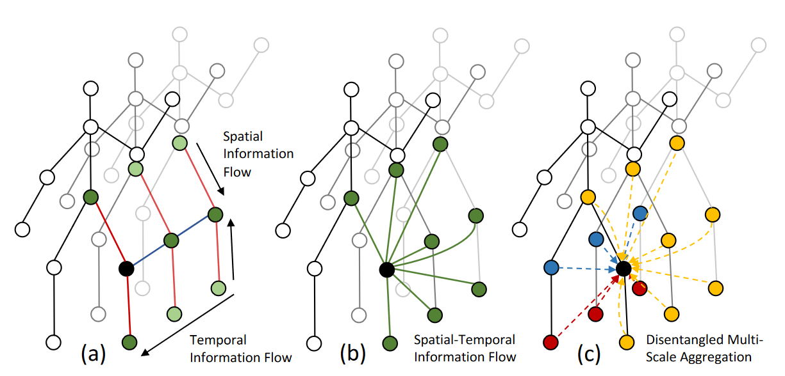
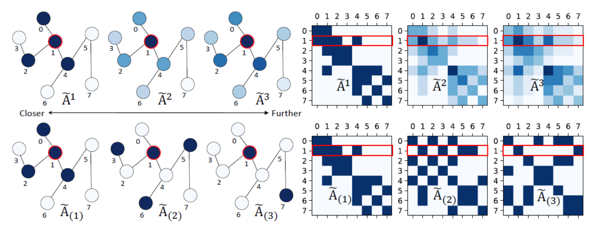
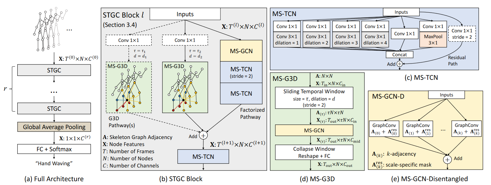
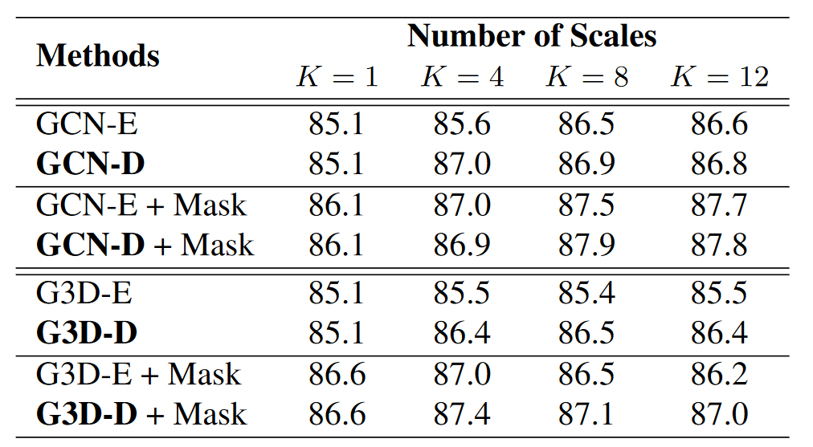
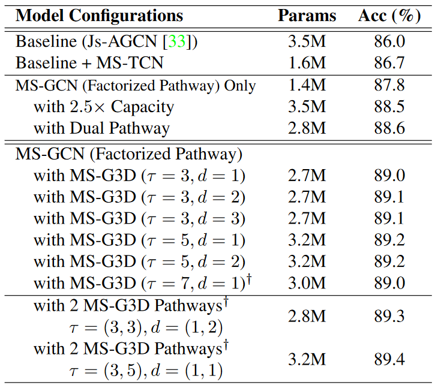
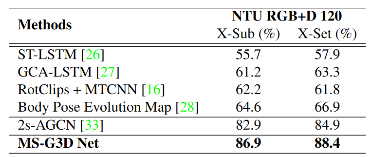
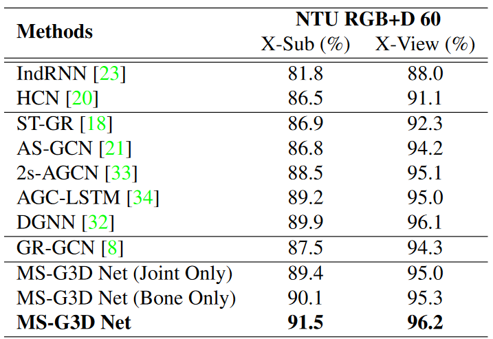
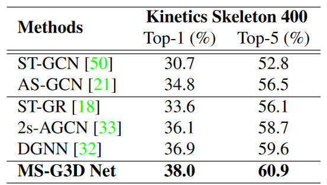

# 基于骨架的动作识别的分解和统一图卷积的研究

## 摘要

​	时空图被广泛应用于基于骨架的动作识别算法来对人类动作动态进行建模。为了从这些图片中获取稳健的运动模式，长期和多尺度的上下文聚合和时空依赖建模是一个强大的特征提取器的重要方面。但是，现有方法在实现 (1) 在多尺度算子下的无偏差长期关节关系建模和 (2) 为捕捉复杂时空依赖的流畅的跨时空信息流等方面存在局限。在这项工作中，我们提出了 (1) 一个用于分解多尺度图卷积的简单方法和 (2) 一种统一的时空图卷积算子，G3D。所提到的多尺度聚合方法解决了在不同邻域中节点对于长期建模的重要性。所提到的G3D模型利用稠密的跨时空边界作为跳跃连接，用于时空图之间直接的信息传播。综上所述，我们开发了一个强大的特征提取器MS-G3D。基于它，我们在3个大规模数据集NTU RGB+D 60、NTU RGB+D 120和Kinetics Skeleton 400上的性能优于之前最先进的方法。

## 1. 引言

>
>
>
>
>图1：(a)分离的骨架图序列时间和空间建模导致间接的信息流。(b) 在这项工作中，我们提出使用统一的时空图卷积来捕获跨时空的相关性。(c) 在不同的时空邻域中分离节点特征(不同距离的黄、蓝、红，部分上色用于区分)对于时空域中的有效的多尺度学习而言十分关键。

​	人类动作识别是许多现实应用中的一项重要任务。特别地，基于骨架的人类动作识别涉及从人类身体的骨架表征预测动作，而非原始的RGB视频，并且最近的工作[^50] [^33] [^32] [^34] [^21] [^20] [^54] [^35]中发现的一些有意义的结果证明了它的优势。对比RGB表征，骨架数据只包含人体关键关节2D[^50] [^15]或3D[^31] [^25]位置，提供了高度抽象的信息并且没有环境噪声(如背景杂波、光照条件、衣服)，使得动作识别算法可以专注于动作的稳健特征。

​    早期的基于骨架的动作识别方法将人体关节看作一组独立的特征，他们通过手动制造的[^42] [^43] 或者学习到的[^31] [^6] [^48] [^54] 特征的集合来建模时间和空间上关节的相关性。然而，这些方法忽视了人体关节之间的内在关系，这种关系最好利用人体骨架图来捕捉，人体骨架图中的关节为节点，它们的自然连接(即“骨头”)为边。因此，最近的研究方法[^50] [^34] [^35] [^32]利用骨架时空图建立了动作的关节运动模式的模型，骨架时空图是一系列不相交、同构的不同时间步长的骨架图，携带空间和时间维度上的信息。 

​    为了从骨架图中获取稳健的动作识别，理想的算法应该超脱局部关节连接性，提取多尺度结构特征和长期依赖关系，因为结构上分离的关节也可以有很强的相关性。许多现有的方法通过使用骨架邻接矩阵[^17]的高次幂来实现这一目的：显然，邻接矩阵的幂来捕获每对节点之间的路径数，且行走的长度与幂相同；邻接多项式通过使远邻可达来增加图卷积的感受野。然而，这种方法存在权重偏差的问题，无向图上环的存在意味着边的权重偏向于更靠近的节点而不是更远的节点。在骨架图上，这意味着邻接矩阵高次幂只能低效地捕捉远处关节的信息，因为聚集的特征将由局部身体部位的关节主导。 这是限制现有多尺度聚合器可伸缩性的一个严重缺陷。

​    稳健的算法的另一个理想特征是利用复杂跨时空关节关系进行动作识别的能力。然而，到目前为止，大多数现有的方法[^50] [^33] [^19] [^32] [^21] [^34] [^18]部署的是只有空间或只有时间的模块(图1 (a) ),类似于分解的3D卷积[^30] [^39]。一个典型的方法是首先使用图卷积提取每个步长的空间关系，然后使用循环神经网络[^19] [^34] [^18]或者一维卷积[^50] [^33] [^21] [^32]层建立时间动态模型。虽然这样的分解方法可以进行有效的长期建模，但是它阻碍了跨时空的直接信息流，无法捕获复杂的区域时空关节依赖。例如，“站立”动作通常是上身在空间和时间上的共同运动，上身的运动(向前倾)与下身未来的运动(站立)有很强的相关性。这些用于预测的有力的线索可能无法有效地被分解的建模方法所捕获。

​    在这项工作中，我们通过两方面解决了上述局限。首先，我们提出了一种新的多尺度聚合方案，通过消除较远和较近邻域之间的冗余依赖关系来解决权重偏差问题，从而理顺多尺度聚合下的特征(如图2所示)。这使我们得到了一个强大的多尺度算子，它可以对关节之间的关系进行建模，而不用考虑它们之间的距离。其次，我们提出了G3D，一个全新的统一的时空图卷积模块，它可以直接对跨时空关节的依赖关系进行建模。G3D通过引入跨“3D”时空域的图形边作为无障碍信息流的跳过连接来做到这一点(图1(b))，实质上促进了时空特征学习。值得注意的是，我们提出的解耦聚合方案强化了 G3D  的多尺度时空推理(图1(c))，尽管引入了额外的边，但是没有受到偏差权重问题的影响。由此产生的强大的特征提取器，G3D，构成了我们在3个大规模骨架数据集：NTU RGB+D 120[^25]、NTU RGB+D 60[^31]和Kinetics Skeleton 400[^15]上优于最先进的方法的最终框架的基石，这项工作的主要贡献概括如下：

(i) 我们提出了一种解耦多尺度聚合的方法，它消除了不同邻域节点特征之间的冗余依赖关系，使得强大的多尺度聚合器能够有效地从人体骨架上捕获图形广义关节关系。

(ii) 我们提出了一种统一的时间-空间图卷积(G3D)算子，它促使信息跨时空直接流动，实现了高效的特征学习。

(iii) 将解耦聚合方案与 G3D 相结合，提供了一个强大的特征提取器(MS-G3D) ，具有跨时空的多尺度感受野。时空特征的直接多尺度聚合进一步提高了模型性能。

## 2. 相关工作

### 2.1. 图神经网络

**架构**. 为了从任意结构的图中提取特征，图神经网络(GNNs)得到了广泛的发展和探索[^5] [^17] [^3] [^2] [^10] [^40] [^49] [^1] [^7] [^11] [^22]。最近提出的GNN方案大致可分为频谱GNN[^3] [^11] [^22] [^13] [^17]和空域GNN[^17] [^49] [^10] [^51] [^41] [^1] [^45]。频谱GNN将输入的图形信号与图傅立叶域中的一组学习滤波器进行卷积。但是，因为特征分解的要求和固定邻接的假设，它们受限于计算效率和新图的推广性。与之相反，空域GNN通常通过(1)选择具有邻域函数的邻居(例如，相邻节点)；(2)使用聚集函数将来自所选择的邻居及其自身的特征合并(例如，均值池)；以及(3)将激活的变换应用于合并的特征(例如，MLP)，来执行针对每个节点的层级更新。在不同的GNN变体中，图卷积网络(GCN)[^17]最初是作为局部频谱卷积的一阶近似引入的，但它作为平均邻域聚合器[^49] [^46]的简单性迅速导致许多后续的空域GNN体系结构[^49] [^1] [^45] [^7]和涉及图结构数据[^44] [^47] [^52] [^50] [^33] [^34] [^21]的各种应用将其视为空域GNN基线。本文采用了GCN中的分层更新规则。

**多尺度图卷积。** 多尺度空域GNNs也被提出用于捕捉非局部邻域的特征。[^1] [^19] [^21] [^45] [^24]这些工作使用图邻接矩阵的邻接矩阵高次幂来聚合来自远处邻居节点的特征。Truncated Block Krylov network[^29]同样将邻接矩阵提高到更高的幂次，并通过不同隐层的密集特征串联来获得多尺度信息。LanczosNet[^24]利用邻接矩阵的低秩近似来加速大型图的幂运算。如第1节所述，我们认为邻接权重可能会因权重偏差而对长期建模产生不利影响，而我们提出的模块旨在通过解耦的多尺度聚合器解决这一问题。 

### 2.2. 骨架动作识别

​    早期的基于骨架的动作识别方法[^42] [^6] [^31] [^36] [^43] [^48] [^54]侧重于下游分类器的手工制作特征和关节关系，忽略了人体重要的语义连接。通过构造时空图和直接用GNNs建模空间关系，最近的方法[^50] [^19] [^8] [^21] [^8] [^33] [^32] [^34] [^18]的性能得到了显著提高，这表明人体骨架的语义对于动作预测的必要性。

​    图卷积的一个早期应用是ST-GCN[^50]，其中空间图卷积与交错时间卷积一起用于时空建模。李等共同作者提出了一个类似的方法[^19]，通过提高骨架邻接矩阵到更高的幂次来引入多尺度模块。AS-GCN[^21]也使用邻接矩阵的幂进行多尺度建模，但它还额外生成人体姿势以增强空间图卷积。时空图路由(STGR)网络[^18]使用逐帧注意和全局自注意机制为骨架图添加额外的边。类似地，2s-AGCN[^33]引入了具有自注意的图形自适应性以及自由学习的图形残差掩码。它还使用具有骨架骨骼特征的双流集成来提高性能。DGNN[^32]同样利用了骨骼特征，但是它通过交替的空间聚合方案同时更新关节和骨骼特征。要提出来的是，上述这些方法主要集中在空间建模上；相比之下，我们提出了一种统一的方法，用于直接跨时空捕获复杂的关节相关性。 

​    另一个相关的工作是GR-GCN[^8]，它在骨架图序列上每三帧合并一次，并在相邻帧之间添加稀疏边。虽然GR-GCN也应用了跨时空边，但跟我们的G3D模块有几个重要区别：(1)G3D中的跨时空边遵循语义人体骨架，与GR-GCN中稀疏的、一刀切的图相比，G3D中的跨时空边自然是一种更可解释、更健壮的表示。底层图形也更容易计算。(2)GR-GCN仅在相邻帧之间具有跨时空边，这使其无法推理超出三个帧的有限时间范围。(3)G3D可以同时利用不同的窗口大小和膨胀从多个时间上下文中学习，这在GR-GCN中没有解决。

## 3. MS-G3D

> 
>
> 
>
> 图二：偏差问题和所提出得解耦聚合方案的图解。颜色越深表示对于中心节点的权重越大(红色)。左上角：越近的节点从邻接矩阵获得更高的权重，这会降低长期建模的效率，特别是在聚合多个尺度时。左下：我们提出的解缠结聚合模型在保持自身特征的同时，对每个邻域的关节关系进行建模。右：可视化相应的邻接矩阵。 为了视觉清晰，省略了节点自环。
### 3.1. Preliminaries 
**注释。** 人体骨架被表示为${\mathcal G} = ({\mathcal V}, {\mathcal E}) $，其中${\mathcal V} = \{{\mathcal v}_1, ..., {\mathcal v}_N\}$是表示关节的$N$ 个节点的集合，${\mathcal E}$是表示由邻接矩阵${\mathbf A} \in  {\mathbb R}^{N\times N}$捕获到的骨架的边的集合，其中如果边从$v_i$指向$v_j$则初始化${\mathbf A}_{i,j}= 1$为1，否则为0。因为${\mathcal G}$是无向的，所以${\mathbf A}$是对称的。动作作为图队列具有节点特征集${\mathcal X} = \{x_{t,n} \in  {\mathbb R}^C \mid t,n \in {\mathbb Z},1 \leq t \leq T,1 \leq n \leq N\}$，表示为特征张量${\mathbf X} \in  {\mathbb R}^{T\times N\times C}$，其中$x_{t,n} = {\mathbf X}_{t,n}$ 是节点 $v_n$ 在总共 $T$ 帧内的 $t$ 时刻的 $C$ 维向量。因此，输入动作在结构上由矩阵${\mathbf A}$、在特征上由张量${\mathbf X}$表述，其中 ${\mathbf X}_t \in  {\mathbb R}^{N\times C}$是在t时刻的节点特征。$\Theta^{(l)} \in {\mathbb R}^{C_{l}\times C_{l+1}}$ 表示网络第 $l$ 层的可学习的权重矩阵。

**图卷积神经网络(GCNs)。** 在特征向量${\mathbf X}$和图${\mathbf A}$定义的骨架输入上，GCNs的分层更新规则可以被应用与时间t处的特征，它的表示如下：
$$
\mathbf{X}_{t}^{(l+1)}=\sigma\left(\tilde{\mathbf{D}}^{-\frac{1}{2}} \tilde{\mathbf{A}} \tilde{\mathbf{D}}^{-\frac{1}{2}} \mathbf{X}_{t}^{(l)} \Theta^{(l)}\right)\tag{1}
$$

其中$\tilde{\mathbf{A}}=\mathbf{A}+\mathbf{I}$是添加了自循环以保持自身特征的骨架图，$\widetilde{D}$是 $\widetilde{\mathbf{A}}$的对角矩阵，$\sigma (·)$是激活函数。 公式 $\widetilde{\mathbf{D}}^{-\frac{1}{2}}\widetilde{\mathbf{A}}\widetilde{\mathbf{D}}^{-\frac{1}{2}}\mathbf{X}^{(l)}_t$可以直观解释为来自直接邻域的近似空间平均特征聚集，随后是激活的线性层。

### 3.2. 分离的多尺度聚合
**偏差权重问题。**在公式1的空间聚集框架下，现有的方法[^21]采用邻接矩阵的高次幂来聚集时间$t$时的多尺度结构信息，公式如下：
$$
\mathbf{X}_{t}^{(l+1)}=\sigma\left(\sum_{k=0}^{K} \widehat{\mathbf{A}}^{k} \mathbf{X}_{t}^{(l)} \Theta_{(k)}^{(l)}\right) \tag{2}
$$
其中 $K$ 控制聚合尺度。 Here, $\widehat{\mathbf{A}}$ 是 $\mathbf{A}$的归一化形式， 例如 [^19] 中使用堆成归一化拉普拉斯图 $\widehat{\mathbf{A}} = \mathbf{L}^{norm} = \mathbf{I}−\mathbf{D}^{−\frac{1}{2}}\mathbf{A}\mathbf{D}^{−\frac{1}{2}} $;  [^21] 中使用随机游走归一化邻接 $\widehat{\mathbf{A}}= \mathbf{D}^{-1} \mathbf{A}$;  更一般地，可以使用GCNs中的 $\widehat{\mathbf{A}}=  \widetilde{\mathbf{D}}^{-\frac{1}{2}} \widetilde{\mathbf{A}} \widetilde{\mathbf{D}}^{-\frac{1}{2}} $。显而易见， $\mathbf{A}^k_{i,j} = \mathbf{A}^k_{j,i}$ 给出了  $v_i$  和  $v_j$ 之间长度为  $k$ 的路径数，因此 $\widehat{\mathbf{A}}^k\mathbf{X}^{(l)}_t$ 正在根据此类步数执行加权特征平均  然而很明显，由于循环遍历，到更近的节点的长度为 $k$ 的路径比实际的 $k$ 跳邻居的数目更多. 这导致权重偏向局部区域和度更高的节点。GCNs中的节点的自环循序更多可能的路径(因为总是可以在自环上循环)从而发达了偏差。参考图2。因此，在骨架图上进行多尺度聚合时，聚合特征将以局部身体部位的信号为主导，从而使用具有较高次幂无法有效捕获长期关节依赖关系。

**对邻域进行分解。** 为了解决上述问题，我们首先将 $k$ 的邻接矩阵  $\widetilde{\mathbf{A}}_{(k)} $ 定义为：
$$
\left[\widetilde{\mathbf{A}}_{(k)} \right]_{i,j}= 
\begin{cases} 
1 & \text {if $d(v_i,v_j)=k$,} \\
1 & \text {if $i=j$,} \\
0 & \text {otherwise,}
\end{cases} \tag{3}
$$
其中 $d(v_i,v_j)$ 给出 $v_i$ and $ v_j$ 之间跳数最短的距离。  $\widetilde{\mathbf{A}}{(k)}$ 是 $\widetilde{\mathbf{A}}$ 到更远邻域的一般化，满足$\widetilde{\mathbf{A}}_{(1)} = \widetilde{\mathbf{A}}$ and $\widetilde{\mathbf{A}}_{(0)} = {\mathbf I}$ 。 在公式(1)的空间聚集下，在 $\widetilde{\mathbf{A}}_{(k)}$ 中包含的自循环对于学习当前关节与其 $k$ 跳邻居之间的关系以及在没有 $k$ 跳邻居时保持每个节点的自身信息非常重要。Given that $N$ is small, $\widetilde{A}_{(k)}$ can be easily computed, $e.g.$, using differences of graph powers as $ \widetilde{\mathbf{A}}_{(k)} = I + {\mathbb 1}( \widetilde{\mathbf{A}}^{k}≥1 ) −{\mathbb 1} ( \widetilde{\mathbf{A}}^{k-1} ≥1 )$. 考虑到 $N$ 很小，因此可以很容易地计算出 $\widetilde{A}_{(k)}$ ，例如，使用图幂之差 $ \widetilde{\mathbf{A}}_{(k)} = I + {\mathbb 1}( \widetilde{\mathbf{A}}^{k}≥1 ) −{\mathbb 1} ( \widetilde{\mathbf{A}}^{k-1} ≥1 )$ 。 将公式(2)中的$\widehat{\mathbf{A}}_{(k)}$ 替换为$\widetilde{\mathbf{A}}_{(k)}$ ，我们得到下式：
$$
\mathbf{X}^{(l+1)}_t=\sigma \left(\sum_{k=0}^K\widetilde{\mathbf{D}}^{-\frac{1}{2}}_{(k)}\widetilde{\mathbf{A}}_{(k)}\widetilde{\mathbf{D}}^{-\frac{1}{2}}_{(k)}\mathbf{X}^{(l)}_t\Theta^{(l)}
_{(k)} \right)\tag{4}
$$
 其中  $\widetilde{\mathbf{D}}^{-\frac{1}{2}}_{(k)}\widetilde{\mathbf{A}}_{(k)}\widetilde{\mathbf{D}}^{-\frac{1}{2}}_{(k)}$ 是归一化[^17]的 $k$ 邻域矩阵。

与之前的情况不同，可能的长度 $k$ 的路径数主要取决于长度 $k−1$ 的路径数，在公式(4)提出的分离公式通过去除较远邻域对较近邻域权重的冗余依赖来解决偏差权重问题。在多尺度算子下，具有较大 $k$ 的额外尺度以相加的方式聚合，使得具有较大k值得长期建模保持有效。所得的 $k$ 的邻接矩阵也比其对应高次幂的矩阵稀疏(参考图2)，从而可以更有效地表示。

### 3.3. G3D：统一的时空模型

​	大多数现有工作将骨架动作视为一系列不相交的图，其中特征是通过仅空间(例如GCN)和仅时间(例如TCN)模块提取的。我们认为，这种分解的方法对于捕获复杂的时空关节关系不太有效。显然，如果一对节点之间存在牢固的连接，则在逐层传播期间，该对节点应包含彼此的显著特征部分以反映这种连接[^50] [^33] [^34]。然而，当信号通过一系列局部聚合器(GCNs和TCNs)在时空中传播时，随着从越来越大的时空感受野聚集冗余信息时，信号会被削弱。如果发现 GCNs 没有执行加权聚合来区分每个邻居，那么这个问题就更明显了。

**跨时空跳跃连接。**  为了解决上述问题，我们提出了一种更合理的方法来允许跨时空跳跃连接，这种方法很容易使用时空图中的跨时空边进行建模。 我们首先考虑输入图序列上一个大小为 $\tau$ 的滑动时间窗口，在每一步中，它都会得到一个时空子图 ${\mathcal G}_{(\tau)} = ({\mathcal V}_{(\tau)},{\mathcal E}_{(\tau)})$ ，其中 ${\mathcal V}_{(\tau)} = {\mathcal V}_1 \, ∪\,...\,∪\,{\mathcal V}_\tau$ 是窗口中 $\tau$ 帧的所有节点集的并集。初始边集合 ${\mathcal E}_{(\tau)}$ 是通过将 $\widetilde{{\mathbf A}}$ 平铺到块邻接矩阵 $\widetilde{{\mathbf A}}_{(\tau)}$来定义的：
$$
\widetilde{{\mathbf A}}_{(\tau)}= 
\left[
\begin{matrix}
\widetilde{{\mathbf A}} & \cdots & \widetilde{{\mathbf A}}\\
\vdots &\ddots & \vdots\\
\widetilde{{\mathbf A}} & \cdots & \widetilde{{\mathbf A}}\\ 
\end{matrix}
\right] \in {\mathbb R}^{\tau N \times \tau N}
\tag{5}
$$
直观地，每个子矩阵 $[\widetilde{\mathbf{A}}_{(τ)}]_{i,j} = \widetilde{\mathbf{A}}$ 意味着 ${\mathcal V}_i$ 中每个节点通过将逐帧的空间连通性(所有 $i$ 的空间连通性为$[\widetilde{\mathbf{A}}_{(τ)}]_{i,i}$)外推到时域，在第 $j$ 帧处连接到自身和它 $1$ 跳的空间邻居。因此， $\mathcal{G}_{(\tau)}$ 内的每个节点都与自身及其跨所有 $\tau$ 帧的 $1$ 跳空间邻居紧密相连。 在 $\mathbf{X}$ 上使用零填充滑动窗  口构造 $T$ 个窗口，可以很容易地得到  ${\mathbf X}_{(\tau)} \in {\mathbb R}^{T \times \tau N \times C}$ 。利用式1，因此我们得出了用于 $t^{th}$ 时间窗口的统一的时空图卷积算子：
$$
\left[{\mathbf X}^{(l+1)}_{(\tau)}\right]= \sigma \left( \widetilde{{\mathbf D}}^{-\frac{1}{2}}_{\tau} \widetilde{{\mathbf A}}_{(\tau)} \widetilde{{\mathbf D}}^{-\frac{1}{2}}_{\tau} \left[ {\mathbf X}^{(l)}_{(\tau)} \right]_t \Theta^{(l)} \right). \tag{6}
$$

**膨胀窗口。**上述窗口结构的另一个重要方面是不需要是相邻帧。通过每 $d$ 帧选取一帧并重用相同的时空结构 $\widetilde{{\mathbf A}}_{(\tau)}$ ，可以构造具有 $τ$ 帧和 $d$ 膨胀率的膨胀窗口。同样，我们可以获得节点特征 ${\mathbf X}_{(\tau,d)} \in {\mathbb R}^{T\times\tau N×C} \; (d = 1\; if \;omitted)$ (被忽略的话d=1)，执行公式6中的逐层更新。膨胀窗口允许更大的时间感受野而不增加 $\widetilde{{\mathbf A}}_{(\tau)}$ 的大小，类似于空洞卷积[^53]如何保持恒定的复杂性。

**多尺度G3D。**  我们也可以将所提出的分离多尺度聚合方案(公式4)整合到G3D中，直接在时空域进行多尺度推理。因此，我们从式6推导出MS-G3D模块为：
$$
\left[ {\mathbf X}^{(l+1)}_{(\tau)} \right]_t = \sigma 
\left( 
\sum_{k=0}^K \widetilde{{\mathbf D}}^{-\frac{1}{2}}_{(\tau,k)} 					\widetilde{{\mathbf A}}_{(\tau,k)}\widetilde{{\mathbf D}}^{-\frac{1}{2}}_{(\tau,k)}
	\left[
    	{\mathbf X}^{(l)}_{(\tau)}
	\right]_t\Theta^{(l)}_{(k)}
\right), \tag{7}
$$
其中  $\widetilde{\mathbf{A}}_{(\tau,k)}$ 和 $\widetilde{\mathbf{D}}_{(\tau,k)}$ 的定义分别类似于 $\widetilde{\mathbf{A}}_{(k)}$ 和 $\widetilde{D}_{(k)}$ 。值得注意的是，我们提出的解缠聚合方案补充了这一统一算子，因为G3D由于时空连通性而增加的节点度数可能会导致有偏权重问题。

**讨论。**   我们对G3D进行了更深入的分析，如下所示。(1)它类似于经典的三维卷积块[^38]，其时空感受野由 $\tau$ 、 $d$ 和 $\widetilde{\mathbf{A}}$ 定义。(2) 与3D卷积不同，G3D的参数由 $\Theta^{(·)}_{(·)}$ 得出独立于 $\tau$ 或 $\mid \mathcal{E}(\tau)\mid$ ，使得它在 $\tau$ 很大的情况下不太容易过拟合。(3)G3D中密集的跨时空连接需要在 $\tau$ 上进行权衡，因为较大的 $\tau$ 值带来了更大的时间感受野，代价是由于更大的邻域而牺牲了更一般的特征。此外，越大的 $\tau$ 意味着 $\widetilde{\mathbf{A}}_{(\tau)}$ 平方级扩大，因此多尺度聚合的运算量越大。另一方面，较大的膨胀率 $d$ 以时间分辨率(较低的帧率)为代价带来更大的时间覆盖。因此必须小心地平衡 $\tau$ 、 $d$ 。(4)G3D模块旨在捕获复杂的区域时空关系，而不是由因数分解模块可以更经济地捕获的长期依赖关系。因此，我们观察到，当G3D模块使用长期的因式分解模块增强时，性能最佳，我们将在下一节讨论这一点。

### 3.4. 模型架构

> 
>
> 
>
> 图3：用不同颜色匹配不同的组件。 **架构概述**：“TCN”、“GCN”、前缀“MS-”和后缀“-D”分别表示时间卷积块和图卷积块，以及多尺度和解缠聚集(第3.2节)。 $r$ 个STGC块(b)中的每一个都使用了多分支设计，以同时捕获长期的和区域时空依赖关系。**虚线连接的模块**，包括额外的G3D分支、1×1卷积层和跨步时间卷积，根据情况权衡模型的性能/复杂性。

**整体架构。** 最终的模型架构如图3所示。在高层次上，它包含 $r$ 个时空图卷积(STGC)块的堆栈，用于从骨架序列中提取特征，随后是全局均值池化层和Softmax分类器。每个STGC块部署两种类型的路径，以同时捕获复杂的区域时空关节相关性以及长期的时空依赖性：(1) G3D路径首先构造时空窗口，对其进行解纠缠的多尺度图卷积，然后用一个全连接层对其进行折叠将窗口特征读出。额外的虚线G3D分支(图3(B)表明该模型可以同时从不同的 $τ$ 和 $d$ 的多个时空上下文中学习；(2) 因式分解路径通过长期、仅空间和仅时间的模块增强了G3D分支：第一层是一个多尺度的图卷积层，能够用最大 $K$ (最长关节间距离)对整个骨架图进行建模；随后是两个多尺度时间卷积层，以捕获扩展的时间上下文(下面讨论)。来自所有分支的输出被聚集为STGC块输出，该STGC块输出在典型的 $r=3$ 块体系结构中分别具有96、192和384个特征通道。批量归一化[^14]和 ReLU 添加到除了最后一层以外的每一层末尾。除第一个块外，所有STGC块均使用步幅为2的时间卷积和滑动窗口在时间维度上进行下采样。

**多尺度时间建模。**  G3D所使用的时空窗口G(τ)本身是一个封闭的结构，这意味着G3D必须伴随时间模块进行跨窗口信息交换。许多现有工作在整个架构中使用具有固定大小为 $k_t \times 1$ 的卷积核的时间卷积对时间建模。我们用多尺度学习增强香草时间卷积层，如图3(c)所示。为了降低额外分支所带来的计算成本，我们采用了瓶颈设计[^37]，将卷积核大小固定为3×1，并使用不同的膨胀率，而不是更大的卷积核来获得更大的感受野。我们还使用残差连接来促进训练。

**自适应图。**   为了提高执行同类邻域平均化的图卷积层的灵活性，我们给每个A~(K)和A~(τ,k)添加一个受[^33]  [^32]启发的简单的、可学习的、无约束的残缺掩码图Ares，以动态地加强、削弱、添加或删除边。例如，公式4更新为
$$
\mathbf{X}_{t}^{(l+1)}=\sigma\left(\sum_{k=0}^{K} \tilde{\mathbf{D}}_{(k)}^{-\frac{1}{2}}\left(\tilde{\mathbf{A}}_{(k)}+\mathbf{A}_{(k)}^{\mathrm{res}}\right) \tilde{\mathbf{D}}_{(k)}^{-\frac{1}{2}} \mathbf{X}_{t}^{(l)} \Theta_{(k)}^{(l)}\right)
$$
Ares被初始化为0左右的随机值，并且对于每个k和τ是不同的，使得每个多尺度上下文(空间或时空)选择最适合的掩码。还要注意的是，由于Ares针对所有可能的动作进行了优化，这些动作可能具有不同的用于特征传播的最佳边集，因此预计它会给出较小的边校正，并且当图结构具有重大缺陷时可能是不够的。特别是，Ares仅部分缓解了偏向加权问题(参见第4.3节)。

**关节-骨骼双流融合。** 受到[^33] [^32] [^34]等工作中的双流方法的启发，以及可视化骨骼和关节可以帮助人类识别骨骼动作的直观，我们使用了一个双流框架，其中具有相同架构的单独模型使用被初始化为远离身体中心的相邻关节矢量差的骨骼特征来训练。来自关节/骨骼模型的softmax得分相加以获得最终预测得分。由于骨架图是树，我们在身体中心添加一个零骨骼向量，以从N个关节获得N个骨骼，并重用A来定义连通性。

## 4. 实验

### 4.1. 数据集

**NTU RGB+D 60 and NTU RGB+D 120。** **NTU RGB+D 60** [^31] 是一个大规模的动作识别数据集，包含56578个骨骼序列，超过60个动作类别，采集自40个不同的对象和3个不同的摄像机视角.每个骨架图包含N=25个身体关节作为节点，其在空间中的3D位置作为初始特征。动作的每一帧包含1到2个对象。其作者建议报告两种情况下的分类准确性：(1)交叉对象(X-Sub)，将40名对象分为训练组和测试组，分别产生40091个和16487个训练和测试样本。(2)交叉视图(X-View)，从1号摄像机收集的18,932个样本全部用于测试，其余37,646个样本用于训练。 **NTU RGB+D 120** [^25] 扩展了NTU RGB+D 60，在60个额外的动作类别中增加了57367个骨骼序列，总计113945个样本，超过120个类别，来自106个不同的对象和32个不同的摄像机设备。作者现在建议将交叉视图的设置替换为交叉设备(X-Set)设置，其中从一半相机设备中收集的54,468个样本用于训练，其余59,477个样本用于测试。在交叉对象方面，从53名受试者中挑选出63,026个样本用于训练，其余50,919个样本用于测试。

**Kinetics Skeleton 400。** Kinetics Skeleton 400数据集是由OpenPose[^4]姿态估计工具箱从Kinetics 400[^15]视频数据集改编而来。它包含总计400个类别的240,436个训练骨架序列和19,796个测试骨架序列，其中每个骨架图包含18个身体关节，以及它们的2D空间坐标和来自OpenPose的预测置信度分数作为初始关节特征[^50]。在每个时间步长，骨架数量上限为2，总体置信度分数较低的骨架将被丢弃。 按照[^15] [^50]中的惯例，报告了Top-1和Top-5的精确度。

### 4.2. 实验细节

​	除非另有说明，否则所有模型的r = 3并以SGD进行训练，其动量为0.9，批大小为32，初始学习率为0.05(可以线性扩展批量大小[^9])对于50、60和65个训练迭代， 对于NTU RGB + D 60、120和Kinetics Skeleton 400，分别在{30，40}，{30，50}和{45，55}个时期，受到LR衰减的0.1个学习率减少。最终模型的权重衰减设置为0.0005，并在组件研究期间进行相应调整。通过重放动作将所有骨架序列填充到T=300帧。 在此之后，使用归一化和转化[^33] [^32]对输入进行预处理。不使用数据增强来进行公平的性能比较。

### 4.3. 组件研究

> 
>
> 
>
> 表1：具有不同K的STGC块的单个路径上的多尺度聚集的准确性(%)。 “掩码”是指残缺掩码 $\mathbf{A}^{\text{res}}$。 如果 $K>1$ ，则GCN/G3D为多尺度(MS-)。
>
> 
>
> 
>
> 表2：各种设置下的模型精度。 MS-GCN和MS-G3D分别使用 $K\in\{12，5\}$ 。$^†$输出通道在折叠窗口层(图3(D)， $C_{mid}$ 到 $C_{out}$ )加倍，而不是在图形卷积( $C_{in}$ 到 $C_{mid}$ )，以维持相似的预算。
>
> 
>
> 表3：比较图连接性设置($\tau=3$，$d=2$)。

我们在最终的架构中分析各个组件及其配置。除非另有说明，性能报告为仅使用关节数据的NTU RGB+D 60交叉对象设置的分类精度。

**分解的多尺度聚合 ** 我们首先通过在稀疏和稠密图上验证其在不同尺度数下的有效性来证明提出的解缠多尺度聚集方案的有效性。在表1中，我们使用STGC块(图3(b))的单独路径，分别称为“GCN”和“G3D”，后缀“-E”和“-D”表示邻接矩阵高次幂和分解。这里，最大 $K = 12$ 是来自NTU RGB+d60的骨架图的直径，对于G3D模块，我们设置 $\tau=5$ 。为了保持一致的归一化，我们在公式2中为GCN-E和G3D-E设置了 $\widehat{\mathbf{A}}=\tilde{\mathbf{D}}^{-\frac{1}{2}} \tilde{\mathbf{A}} \tilde{\mathbf{D}}^{-\frac{1}{2}}$ 。我们首先观察到，分解的因式分解比简单邻接矩阵幂在 $K = 4$ 时可带来高达1.4%的增益，支持邻域分解的必要性。在这种情况下，残缺掩码 $\mathbf{A}^\text{res}$ 部分校正了权重不平衡，将最大差距缩小到0.4%。然而，在G3D路径上的同一组实验中，窗口图 $\mathcal{G}{(\tau)}$ 比空间图 $\mathcal{G}$ 的密度更大，显示 G3D-E 和 G3D-D 之间的精度差距更大，这表明存在更严重的有偏加权问题。具体地说，即使添加残缺掩码，我们在 $K = 12$ 时也会看到0.8%的性能差距。这些结果验证了所提出的解缠聚合方案在多尺度学习中的有效性；它不仅在空间域中提高了不同数字尺度上的性能，而且在时空域中更是如此，它补充了所提出的G3D模块。一般来说，空间GCN比时空G3D模块从大K中获益更多；对于最终的体系结构，我们分别为MS-GCN和MS-G3D块分别设置 $K \in\{12,5\}$ 。

**G3D的有效性。** 为了验证G3D模块捕获复杂时空特征的有效性，我们使用其单独的组件逐步构建模型，并在表2中显示其性能。我们使用来自2S-AGCN[^33]的关节流作为控制实验的基线，并且为了公平比较，我们用MS-TCN层替换其规则的时间卷积层，得到了参数量变少的改进。首先，我们观察到，由于MS-GCN中强大的分离聚集作用，因式分解途径本身就可以优于基线。然而，如果我们简单地将因式分解的路径放大到更大的容量(更深和更宽)，或者复制因式分解的路径以从不同的特征子空间中学习并模仿STGC块中的多路径设计，我们观察到的收益是有限的。相反,当添加G3D路径时，我们在相似或更少的参数下观察到一致更好的结果，验证了G3D提取复杂的区域时空相关性的能力，这些相关性以前通过以因式分解的方式建模空间和时间依赖而被忽略。

**探索G3D配置。 **表2还比较了各种G3D设置，包括不同的 $\tau$ 、 $d$ 值和 STGC 块中 G3D 路径的数量。首先，我们观察到所有的配置一致地优于基线，证实了MS-G3D作为一个健壮的特征提取器的稳定性。我们还发现 $\tau = 5$ 的结果稍好一些，但在 $\tau = 7$ 时，由于局部时空邻域过大，聚集的特征变得过于通用，因此抵消了较大时间覆盖的好处。扩张率 $d$ 具有不同的影响：(1)当 $\tau = 3$ 时， $d = 1$ 的性能低于 $d \in \{2,3\}$ ，证明需要更大的时间上下文；(2)更大的 $d$ 具有边际效益，因为其更大的时间覆盖以时间分辨率为代价(从而粗糙化骨骼运动)。因此，当 $d = (1,2)$ 的两条 G3D 路径组合时，我们观察到更好的结果,不出所料，当时间分辨率通过设置 $\tau = (3,5)$ 保持不变时，我们获得了最好的结果。

**跨时空连接性。 **为了证明在公式5中定义的 $\mathcal{G}{(\tau)}$ 中需要跨时空边，而不是简单的、类似网格的时间自边(G3D也适用于此)，我们对比了表3中的不同连接方案，同时固定了架构的其他部分。 前两个设置指的是修改块邻接矩阵 $\tilde{\mathbf{A}}_{(\tau)}$ ，使得(1) 保留主对角线上的块 $\tilde{\mathbf{A}}$ ，将超对角线对角线上的块设置为 $\mathbf{I}$ ，其余设置为 $\mathbf{0}$ ；(2)除主对角线的 $\tilde{\mathbf{A}}$ 的外的所有块均设置为 $\mathbf{I}$ 。第一种方法生成“3D网格”图形，第二种方法在 $\tau$ 帧上包含额外密集的自边。显然，虽然所有的设置都允许统一的时空图形卷积，但作为跳过连接的跨时空边对于有效的信息流是必不可少的。

 **关节-骨骼双流融合。 **我们在NTU RGB+D60数据集上验证了我们在关节骨骼融合框架下的方法(表5)。与[^33]相似，我们在融合关节和骨骼特征时获得了最佳性能，这表明我们的方法可以推广到其他输入模式。

### 4.4. 与最新技术的比较

> 
>
> 
>
> 表4：在NTU RGB+D 120骨骼数据集上的分类精度与最新方法的比较。
>
> 
>
> 
>
> 表5：NTU RGB+D60骨架数据集分类精度与最新方法的比较。
>
> 
>
> 
>
> 表6：Kinetics Skeleton 400数据集上的分类精度与最新方法的比较。

在表4、5、6中，我们将我们的完整模型(图3(a))与最先进的模型进行了比较。表4比较了非图形方法和基于图形的方法。表5比较了非图形方法、基于图形的带有空间连线的方法和同样基于图形的带有时空连线的方法。表6比较了单流和多流方法。在这三个大规模的数据集上，我们的方法在所有评估设置下都优于所有现有的方法。值得注意的是，我们的方法是第一个应用多路径设计从骨架序列中学习长距离的空间和时间依赖性以及复杂的区域空间-时间相关性，结果验证了我们方法的有效性。

## 5. 结论

​    在这项工作中，我们提出了两种改进基于骨架的动作识别的方法：一种是去除不同邻域之间冗余依赖的解耦多尺度图卷积聚集方案；另一种是G3D，它是一种统一的时空图卷积算子，它直接从骨架图序列中建模时空依赖关系。通过整合这些方法，我们得到了MS-G3D，这是一个功能强大的特征提取器，它捕获了以前被因式分解方法建模忽视的多尺度时空特征。在三个大规模数据集上的实验表明，我们的模型相比现有的方法有相当大的优势。

**鸣谢：**这项工作得到了澳大利亚研究委员会的资助DP200103223。感谢Weiqing Cao设计数据。

## References

[^1]:Sami Abu-El-Haija, Bryan Perozzi, Amol Kapoor, Nazanin Alipourfard, Kristina Lerman, Hrayr Harutyunyan, Greg Ver Steeg, and Aram Galstyan. MixHop: Higher-order graph convolutional architectures via sparsified neighborhood mixing. In Kamalika Chaudhuri and Ruslan Salakhutdinov, edtors, Proceedings of the 36th International Conference on Machine Learning, volume 97 of Proceedings of Machine Learning Research, pages 21–29, Long Beach, California, USA, 09–15 Jun 2019. PMLR.  
[^2]:James Atwood and Don Towsley. Diffusion-convolutional neural networks. In Advances in Neural Information Proessing Systems, pages 1993–2001, 2016.  
[^3]:Joan Bruna, Wojciech Zaremba, Arthur Szlam, and Yann Le-Cun. Spectral networks and locally connected networks on graphs. arXiv preprint arXiv:1312.6203, 2013.  
[^4]:Zhe Cao, Tomas Simon, Shih-En Wei, and Yaser Sheikh. Realtime multi-person 2d pose estimation using part affinity fields. 2017 IEEE Conference on Computer Vision and Pattern Recognition (CVPR), Jul 2017.  
[^5]:Micha ̈el Defferrard, Xavier Bresson, and Pierre Vandergheynst. Convolutional neural networks on graphs with fast localized spectral filtering. In Advances in neural information processing systems, pages 3844–3852, 2016.  
[^6]:Yong Du, Wei Wang, and Liang Wang. Hierarchical recurrent neural network for skeleton based action recognition. In Proceedings of the IEEE conference on computer vision and pattern recognition, pages 1110–1118, 2015.  
[^7]:Hongyang Gao and Shuiwang Ji. Graph u-nets. In Proceedings of the 36th International Conference on Machine Learning, ICML 2019, 9-15 June 2019, Long Beach, California, USA, pages 2083–2092, 2019.  
[^8]:Xiang Gao, Wei Hu, Jiaxiang Tang, Jiaying Liu, and Zongming Guo. Optimized skeleton-based action recognition via sparsified graph regression. In Proceedings of the 27th ACM International Conference on Multimedia, MM ’19, pages 601–610, New York, NY, USA, 2019. ACM.  
[^9]:Priya Goyal, Piotr Doll ́ar, Ross Girshick, Pieter Noordhuis, Lukasz Wesolowski, Aapo Kyrola, Andrew Tulloch, Yangqing Jia, and Kaiming He. Accurate, large minibatch sgd: Training imagenet in 1 hour. arXiv preprint arXiv:1706.02677, 2017.  
[^10]:Will Hamilton, Zhitao Ying, and Jure Leskovec. Inductive representation learning on large graphs. In Advances in Neural Information Processing Systems, pages 1024–1034, 2017.  
[^11]:David K Hammond, Pierre Vandergheynst, and R ́emi Gribonval. Wavelets on graphs via spectral graph theory. Applied and Computational Harmonic Analysis, 30(2):129– 150, 2011.  
[^12]:Kaiming He, Xiangyu Zhang, Shaoqing Ren, and Jian Sun. Deep residual learning for image recognition. In Proceedings of the IEEE conference on computer vision and pattern recognition, pages 770–778, 2016.  
[^13]:Mikael Henaff, Joan Bruna, and Yann LeCun. Deep convolutional networks on graph-structured data, 2015.  
[^14]:Sergey Ioffe and Christian Szegedy. Batch normalization: Accelerating deep network training by reducing internal covariate shift. arXiv preprint arXiv:1502.03167, 2015.  
[^15]:Will Kay, Joao Carreira, Karen Simonyan, Brian Zhang, Chloe Hillier, Sudheendra Vijayanarasimhan, Fabio Viola, Tim Green, Trevor Back, Paul Natsev, Mustafa Suleyman, and Andrew Zisserman. The kinetics human action video dataset, 2017.  
[^16]:Qiuhong Ke, Mohammed Bennamoun, Senjian An, Ferdous Sohel, and Farid Boussaid. Learning clip representations for skeleton-based 3d action recognition. IEEE Transactions on Image Processing, 27(6):2842–2855, 2018.  
[^17]:Thomas N Kipf and Max Welling. Semi-supervised classification with graph convolutional networks. arXiv preprint arXiv:1609.02907, 2016.  
[^18]:Bin Li, Xi Li, Zhongfei Zhang, and Fei Wu. Spatiotemporal graph routing for skeleton-based action recognition. In Thirty-Third AAAI Conference on Artificial Intelligence, 2019.  
[^19]:Chaolong Li, Zhen Cui, Wenming Zheng, Chunyan Xu, and Jian Yang. Spatio-temporal graph convolution for skeleton based action recognition. In Thirty-Second AAAI Conference on Artificial Intelligence, 2018.  
[^20]:Chao Li, Qiaoyong Zhong, Di Xie, and Shiliang Pu. Cooccurrence feature learning from skeleton data for action recognition and detection with hierarchical aggregation. Proceedings of the Twenty-Seventh International Joint Conference on Artificial Intelligence, Jul 2018.  
[^21]:Maosen Li, Siheng Chen, Xu Chen, Ya Zhang, Yanfeng Wang, and Qi Tian. Actional-structural graph convolutional networks for skeleton-based action recognition. In Proceedings of the IEEE Conference on Computer Vision and Pattern Recognition, pages 3595–3603, 2019.  
[^22]:Ruoyu Li, Sheng Wang, Feiyun Zhu, and Junzhou Huang. Adaptive graph convolutional neural networks. In ThirtySecond AAAI Conference on Artificial Intelligence, 2018.  
[^23]:Shuai Li, Wanqing Li, Chris Cook, Ce Zhu, and Yanbo Gao. Independently recurrent neural network (indrnn): Building a longer and deeper rnn. 2018 IEEE/CVF Conference on Computer Vision and Pattern Recognition, Jun 2018.  
[^24]:Renjie Liao, Zhizhen Zhao, Raquel Urtasun, and Richard S Zemel. Lanczosnet: Multi-scale deep graph convolutional networks. arXiv preprint arXiv:1901.01484, 2019.  
[^25]:Jun Liu, Amir Shahroudy, Mauricio Lisboa Perez, Gang Wang, Ling-Yu Duan, and Alex Kot Chichung. Ntu rgb+d 120: A large-scale benchmark for 3d human activity understanding. IEEE Transactions on Pattern Analysis and Machine Intelligence, page 11, 2019.  
[^26]:Jun Liu, Amir Shahroudy, Dong Xu, and Gang Wang. Spatio-temporal lstm with trust gates for 3d human action recognition. In European Conference on Computer Vision, pages 816–833. Springer, 2016.  
[^27]:Jun Liu, Gang Wang, Ling-Yu Duan, Kamila Abdiyeva, and Alex C Kot. Skeleton-based human action recognition with global context-aware attention lstm networks. IEEE Transactions on Image Processing, 27(4):1586–1599, 2017.  
[^28]:Mengyuan Liu and Junsong Yuan. Recognizing human actions as the evolution of pose estimation maps. In Proceedings of the IEEE Conference on Computer Vision and Pattern Recognition, pages 1159–1168, 2018.  
[^29]:Sitao Luan, Mingde Zhao, Xiao-Wen Chang, and Doina Precup. Break the ceiling: Stronger multi-scale deep graph convolutional networks. arXiv, 1906.02174, 2019.  
[^30]:Zhaofan Qiu, Ting Yao, and Tao Mei. Learning spatiotemporal representation with pseudo-3d residual networks. In proceedings of the IEEE International Conference on Computer Vision, pages 5533–5541, 2017.  
[^31]: Amir Shahroudy, Jun Liu, Tian-Tsong Ng, and Gang Wang. Ntu rgb+d: A large scale dataset for 3d human activity analysis. In IEEE Conference on Computer Vision and Pattern Recognition, June 2016.    
[^32]:Lei Shi, Yifan Zhang, Jian Cheng, and Hanqing Lu. Skeleton-based action recognition with directed graph neural networks. In Proceedings of the IEEE Conference on Computer Vision and Pattern Recognition, pages 7912–7921, 2019.  
[^33]:Lei Shi, Yifan Zhang, Jian Cheng, and Hanqing Lu. Twostream adaptive graph convolutional networks for skeletonbased action recognition. In Proceedings of the IEEE Conference on Computer Vision and Pattern Recognition, pages 12026–12035, 2019.  
[^34]:Chenyang Si, Wentao Chen, Wei Wang, Liang Wang, and Tieniu Tan. An attention enhanced graph convolutional lstm network for skeleton-based action recognition. In Proceedings of the IEEE Conference on Computer Vision and Pattern Recognition, pages 1227–1236, 2019.  
[^35]:Chenyang Si, Ya Jing, Wei Wang, Liang Wang, and Tieniu Tan. Skeleton-based action recognition with spatial reasoning and temporal stack learning. In Proceedings of the European Conference on Computer Vision (ECCV), pages 103– 118, 2018.  
[^36]:Sijie Song, Cuiling Lan, Junliang Xing, Wenjun Zeng, and Jiaying Liu. An end-to-end spatio-temporal attention model for human action recognition from skeleton data. In Thirtyfirst AAAI conference on artificial intelligence, 2017.  
[^37]:Christian Szegedy, Sergey Ioffe, Vincent Vanhoucke, and Alex Alemi. Inception-v4, inception-resnet and the impact of residual connections on learning, 2016.  
[^38]:Du Tran, Lubomir Bourdev, Rob Fergus, Lorenzo Torresani, and Manohar Paluri. Learning spatiotemporal features with 3d convolutional networks. In Proceedings of the IEEE international conference on computer vision, pages 4489–4497, 2015.  
[^39]:Du Tran, Heng Wang, Lorenzo Torresani, Jamie Ray, Yann LeCun, and Manohar Paluri. A closer look at spatiotemporal convolutions for action recognition. In Proceedings of the IEEE conference on Computer Vision and Pattern Recognition, pages 6450–6459, 2018.  
[^40]:Petar Veliˇckovi ́c, Guillem Cucurull, Arantxa Casanova, Adriana Romero, Pietro Lio, and Yoshua Bengio. Graph attention networks. In International Conference on Learning Representations (ICLR), 2018.  
[^41]:Petar Veliˇckovi ́c, William Fedus, William L Hamilton, Pietro Lio, Yoshua Bengio, and R Devon Hjelm. Deep graph infomax. arXiv preprint arXiv:1809.10341, 2018.  
[^42]:Raviteja Vemulapalli, Felipe Arrate, and Rama Chellappa. Human action recognition by representing 3d skeletons as points in a lie group. In Proceedings of the IEEE conference on computer vision and pattern recognition, pages 588–595, 2014.  
[^43]:Jiang Wang, Zicheng Liu, Ying Wu, and Junsong Yuan. Mining actionlet ensemble for action recognition with depth cameras. In 2012 IEEE Conference on Computer Vision and Pattern Recognition, pages 1290–1297. IEEE, 2012.  
[^44]:Xiaolong Wang and Abhinav Gupta. Videos as space-time region graphs. In Proceedings of the European Conference on Computer Vision (ECCV), pages 399–417, 2018.  
[^45]:Felix Wu, Amauri Souza, Tianyi Zhang, Christopher Fifty, Tao Yu, and Kilian Weinberger. Simplifying graph convolutional networks. In Kamalika Chaudhuri and Ruslan Salakhutdinov, editors, Proceedings of the 36th International Conference on Machine Learning, volume 97 of Proceedings of Machine Learning Research, pages 6861–6871, Long Beach, California, USA, 09–15 Jun 2019. PMLR.  
[^46]:Zonghan Wu, Shirui Pan, Fengwen Chen, Guodong Long, Chengqi Zhang, and Philip S. Yu. A comprehensive survey on graph neural networks. CoRR, abs/1901.00596, 2019.  
[^47]:Zonghan Wu, Shirui Pan, Guodong Long, Jing Jiang, and Chengqi Zhang. Graph wavenet for deep spatial-temporal graph modeling. arXiv preprint arXiv:1906.00121, 2019.  
[^48]:Chunyu Xie, Ce Li, Baochang Zhang, Chen Chen, Jungong Han, and Jianzhuang Liu. Memory attention networks for skeleton-based action recognition. Proceedings of the Twenty-Seventh International Joint Conference on Artificial Intelligence, Jul 2018.  
[^49]:Keyulu Xu, Weihua Hu, Jure Leskovec, and Stefanie Jegelka. How powerful are graph neural networks? In International Conference on Learning Representations (ICLR), 2019.  
[^50]: Sijie Yan, Yuanjun Xiong, and Dahua Lin. Spatial tempo-ral graph convolutional networks for skeleton-based action recognition. In Thirty-Second AAAI Conference on ArtificialIntelligence, 2018.  
[^54]:Zhitao Ying, Jiaxuan You, Christopher Morris, Xiang Ren, Will Hamilton, and Jure Leskovec. Hierarchical graph representation learning with differentiable pooling. In Advances in Neural Information Processing Systems, pages 4800– 4810, 2018.  
[^52]:Bing Yu, Haoteng Yin, and Zhanxing Zhu. Spatio-temporal graph convolutional networks: A deep learning framework for traffic forecasting. arXiv preprint arXiv:1709.04875, 2017.  
[^53]:Fisher Yu and Vladlen Koltun. Multi-scale context aggregation by dilated convolutions, 2015.  
[^54]:Pengfei Zhang, Cuiling Lan, Junliang Xing, Wenjun Zeng, Jianru Xue, and Nanning Zheng. View adaptive recurrent neural networks for high performance human action recognition from skeleton data. In Proceedings of the IEEE International Conference on Computer Vision, pages 2117–2126, 2017.  
